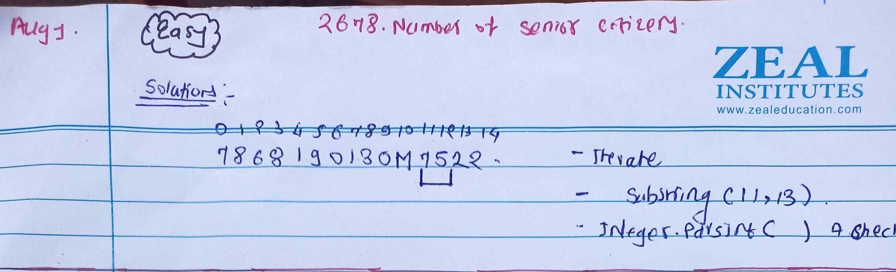

<!-- August-1-->

# LeetCode - [2678. Number of Senior Citizens](https://leetcode.com/problems/number-of-senior-citizens/description/)

**Difficulty:** Easy

**Category:**  String


---

## Dry Run

<p align="middle">
   
</p>

---

## Solution

```java
class Solution {
    public int countSeniors(String[] details) {
        int ans = 0;
        for (String str : details) {
            int age = Integer.parseInt(str.substring(11, 13));
            ans += age > 60 ? 1 : 0;
        }
        return ans;
    }
}
```
