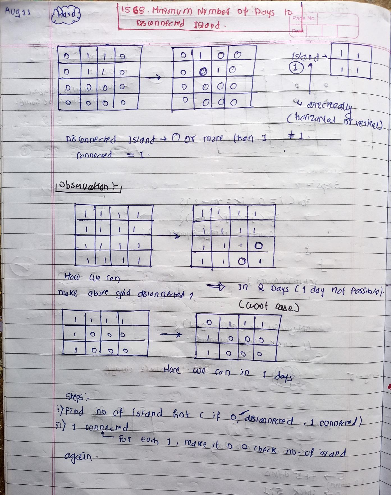

<!-- August-11-->

# LeetCode - [1568. Minimum Number of Days to Disconnect Island](https://leetcode.com/problems/minimum-number-of-days-to-disconnect-island/description/)

**Difficulty:** Hard

**Category:**  DFS

---

## Dry Run

<p align="middle">
   
</p>

---

## Solution

```java
class Solution {
    private final int[][] directions = { { 1, 0 }, { 0, 1 }, { -1, 0 }, { 0, -1 } };

    private void DFS(int[][] grid, boolean[][] visited, int m, int n, int i, int j) {
        if (i < 0 || i >= m || j < 0 || j >= n || grid[i][j] == 0 || visited[i][j]) {
            return;
        }

        visited[i][j] = true;

        for (int[] dir : this.directions) {
            int new_i = i + dir[0];
            int new_j = j + dir[1];
            this.DFS(grid, visited, m, n, new_i, new_j);
        }
    }

    private int calculateNoOfIsland(int[][] grid, int m, int n) {
        int noOfIsland = 0;
        boolean[][] visited = new boolean[m][n];
        for (int i = 0; i < m; i++) {
            for (int j = 0; j < n; j++) {
                if (grid[i][j] == 1 && !visited[i][j]) {
                    this.DFS(grid, visited, m, n, i, j);
                    noOfIsland++;
                }
            }
        }
        return noOfIsland;
    }

    public int minDays(int[][] grid) {
        int m = grid.length;
        int n = grid[0].length;
        int noOfIsland = this.calculateNoOfIsland(grid, m, n) ;
        if (noOfIsland == 0 || noOfIsland >1) {
            return 0;
        } else {
            for (int i = 0; i < m; i++) {
                for (int j = 0; j < n; j++) {
                    if (grid[i][j] == 1) {
                        grid[i][j] = 0;
                        int noOfIsland_modify = this.calculateNoOfIsland(grid, m, n) ;
                        if (noOfIsland_modify==0 || noOfIsland_modify>1) {
                            return 1;
                        }
                        grid[i][j] = 1;
                    }
                }
            }
        }

        return 2;

    }
}
```
