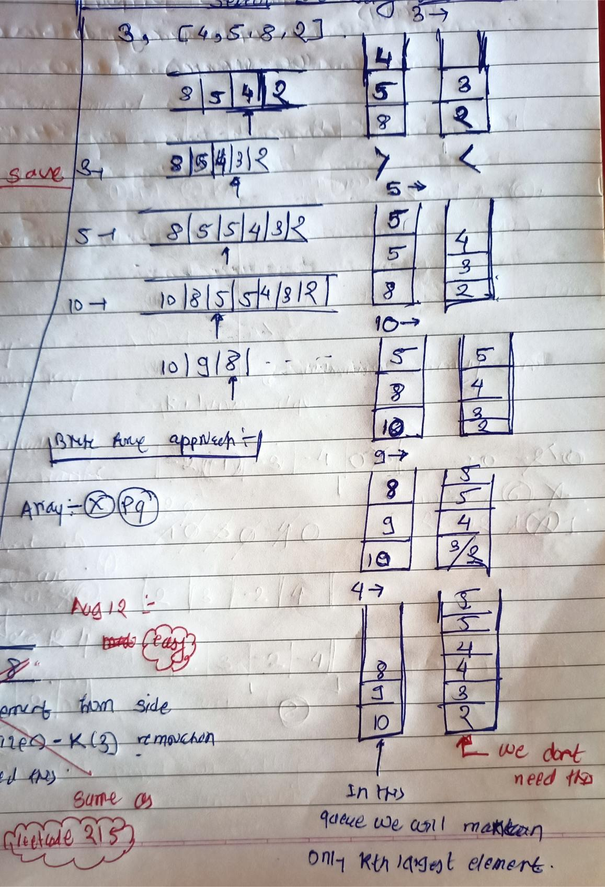

<!-- August-12-->

# LeetCode - [703. Kth Largest Element in a Stream](https://leetcode.com/problems/kth-largest-element-in-a-stream/description/)

**Difficulty:** Easy

**Category:**  PriorityQueue

**Hint:** Same as Leetcode 215, 28 day of 75dayschallenge

---

## Dry Run

<p align="middle">
   
</p>

---

## Solution

```java

class KthLargest {
    private final int k;
    private final Queue<Integer> queue;   //min-heap

    public KthLargest(int k, int[] nums) {
        this.k = k;
        this.queue = new PriorityQueue<>();
        for (int num : nums) {
            add(num);
        }
    }

    public int add(int val) {
        queue.offer(val);
        if (queue.size() > k) {
            queue.poll();
        }
        return queue.peek();
    }
}

/**
 * Your KthLargest object will be instantiated and called as such:
 * KthLargest obj = new KthLargest(k, nums);
 * int param_1 = obj.add(val);
 */
```
