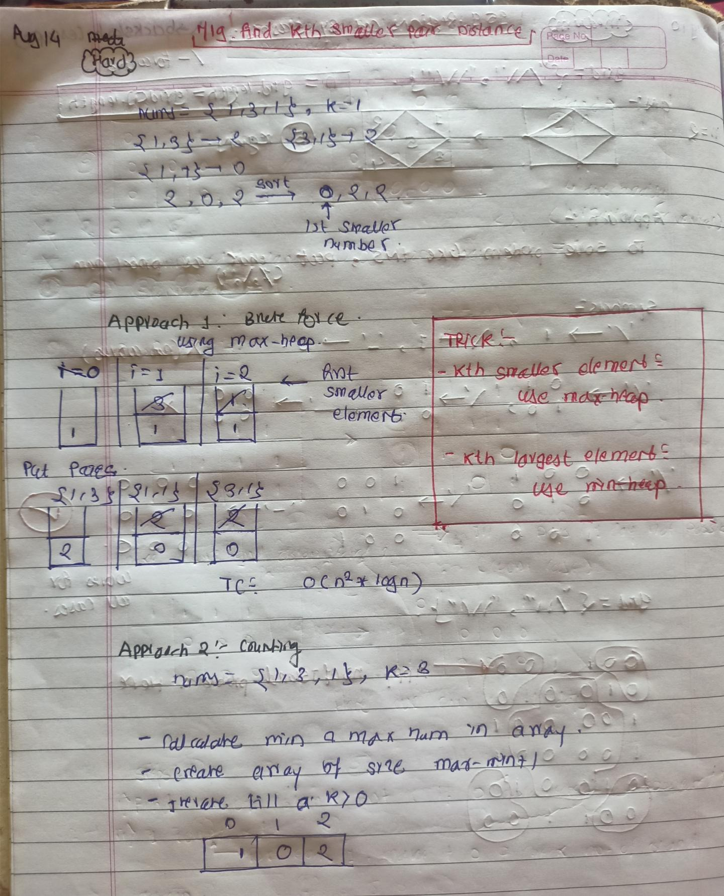

<!-- August-14-->

# LeetCode - [719. Find K-th Smallest Pair Distance](https://leetcode.com/problems/find-k-th-smallest-pair-distance/description/)

**Difficulty:** Hard

**Category:**  PriorityQueue, Array

---

## Dry Run

<p align="middle">
   
</p>

---

## Solution

```java
// Brute Force Approach:
// class Solution {
//     public int smallestDistancePair(int[] nums, int k) {
//         Queue<Integer> maxHeap = new PriorityQueue<>(Comparator.reverseOrder());
//         int n = nums.length;
//         for (int i = 0; i < n; i++) {
//             for (int j = i + 1; j < n; j++) {
//                 int a = nums[i];
//                 int b = nums[j];
//                 maxHeap.offer(Math.abs(a - b));
//                 if (maxHeap.size() > k) {
//                     maxHeap.poll();
//                 }
//             }
//         }
//         return maxHeap.peek();
//     }
// }

//O(n2)
class Solution {
    public int smallestDistancePair(int[] nums, int k) {
        int n = nums.length;
        int minNum = Integer.MAX_VALUE;
        int maxNum = Integer.MIN_VALUE;

        // Find the minimum and maximum value in the array
        for (int num : nums) {
            minNum = Math.min(minNum, num);
            maxNum = Math.max(maxNum, num);
        }

        // Create a count array to store the frequency of each distance
        int[] count = new int[maxNum - minNum + 1];

        // Fill the count array with the frequency of absolute differences
        for (int i = 0; i < n; i++) {
            for (int j = i + 1; j < n; j++) {
                int a = nums[i];
                int b = nums[j];
                count[Math.abs(a - b)]++;
            }
        }

        // Determine the k-th smallest distance
        int idx = 0;
        while (k > 0) {
            k -= count[idx++];
        }

        // The correct k-th smallest distance
        return idx - 1;
    }
}

```
