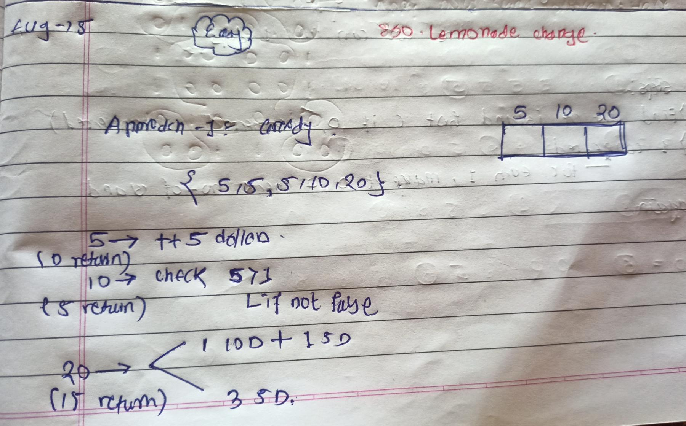

<!-- August-15-->

# LeetCode - [860. Lemonade Change](https://leetcode.com/problems/lemonade-change/description/)

**Difficulty:** Easy

**Category:**  Greedy, Array


---

## Dry Run

<p align="middle">
   
</p>

---

## Solution

```java
class Solution {
    //  public boolean lemonadeChange(int[] bills) {
    //     int[] count = new int[3];

    //     for (int bill : bills) {
    //         if (bill == 5) {
    //             count[0]++;
    //             continue;
    //         }

    //         if (bill == 10) {
    //             if (count[0] > 0) {
    //                 count[0]--;
    //                 count[1]++;
    //             } else {
    //                 return false;
    //             }

    //             continue;
    //         }

    //         if (bill == 20) {

    //             if (count[1] >= 1 && count[0] >= 1) {
    //                 count[1]--;
    //                 count[0]--;
    //                 count[2]++;
    //             } else if (count[0] >= 3) {
    //                 count[0] -= 3;
    //                 count[2]++;
    //             } else {
    //                 return false;
    //             }
    //         }
    //     }

    //     return true;
    // }

    public boolean lemonadeChange(int[] bills) {
        int[] count = new int[3];

        for (int bill : bills) {
            if (bill == 5) {
                count[0]++;
            } else if (bill == 10) {
                if (count[0] > 0) {
                    count[0]--;
                    count[1]++;
                } else {
                    return false;
                }
            } else {
                if (count[1] >= 1 && count[0] >= 1) {
                    count[1]--;
                    count[0]--;
                    count[2]++;
                } else if (count[0] >= 3) {
                    count[0] -= 3;
                    count[2]++;
                } else {
                    return false;
                }
            }
        }

        return true;
    }


}
```
