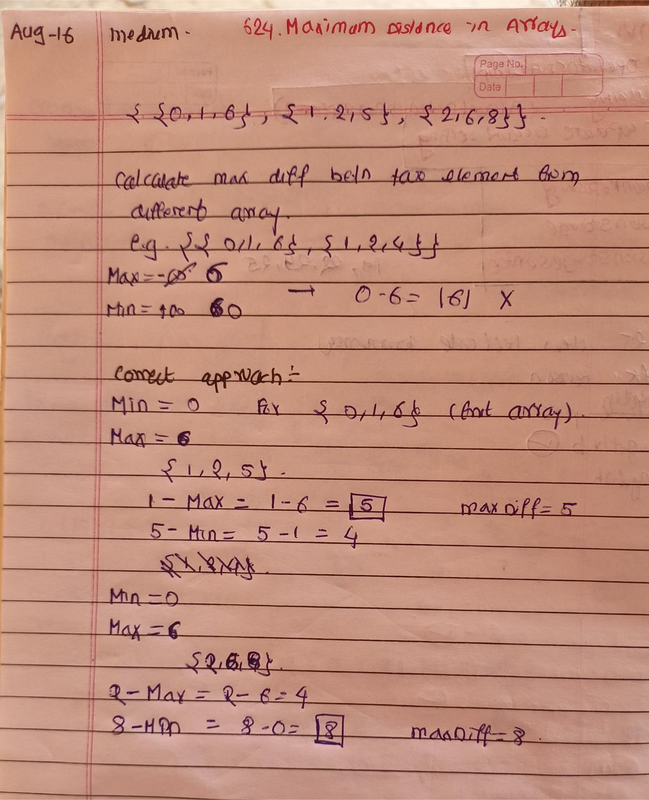

<!-- August-16-->

# LeetCode - [624. Maximum Distance in Arrays](https://leetcode.com/problems/maximum-distance-in-arrays/description/)

**Difficulty:**Medium

**Category:**  Array


---

## Dry Run

<p align="middle">
   
</p>

---

## Solution

```java
class Solution {
    public int maxDistance(List<List<Integer>> arrays) {
        int diff = Integer.MIN_VALUE;
        int MIN = arrays.get(0).get(0);
        int MAX = arrays.get(0).get(arrays.get(0).size()-1);

        for(int i=1 ;i<arrays.size();i++){
            List<Integer> list = arrays.get(i);

            diff = Math.max(diff, Math.abs(list.get(0) - MAX));
            diff = Math.max(diff, Math.abs(list.get(list.size()-1) - MIN));

            MIN = Math.min(list.get(0),MIN);
            MAX = Math.max(list.get(list.size()-1),MAX);
        }

        return diff ;
    }
}
```
