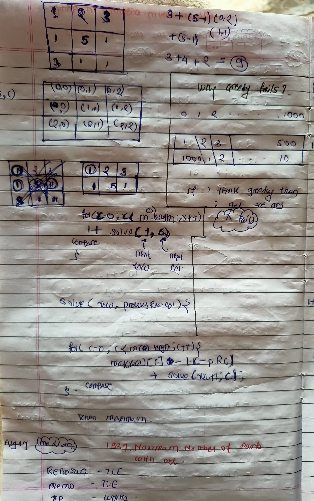

<!-- August-17-->

# LeetCode - [1937. Maximum Number of Points with Cost](https://leetcode.com/problems/maximum-number-of-points-with-cost/description/)

**Difficulty:** Medium

**Category:**  DP

---

## Dry Run

<p align="middle">
   
</p>

---

## Solution

```java
//   class Solution {
//         int m;
//         int n;

//         private int solve(int[][] points, int row, int preRowCol) {
//             if(row>=m){
//                  return 0 ;
//             }
//             int ans = Integer.MIN_VALUE;
//             for (int col = 0; col < n; col++) {
//                 int currMax = points[row][col] - Math.abs(col - preRowCol) + solve(points, row + 1, col);
//                 ans = Math.max(ans, currMax);
//             }
            
//             return ans;
//         }

//         public long maxPoints(int[][] points) {
//             m = points.length;
//             n = points[0].length;
//             int ans = Integer.MIN_VALUE;
//             for (int col = 0; col < n; col++) {
//                 int currMax = points[0][col] + solve(points, 1, col);
//                 ans = Math.max(ans, currMax);
//             }
//             return ans;
//         }
//     }


//O(m×n2)
//O(m*n)
 class Solution {
        int m;
        int n;

        private int solve(int[][] points, int [][]memo, int row, int preRowCol) {
            if(row>=m){
                return 0 ;
            }

            if(memo[row][preRowCol]!=-1){
                 return memo[row][preRowCol];
            }

            int ans = Integer.MIN_VALUE;

            for (int col = 0; col < n; col++) {
                int currMax = points[row][col] - Math.abs(col - preRowCol) + solve(points, memo, row + 1, col);
                ans = Math.max(ans, currMax);
            }
            memo[row][preRowCol] = ans ;
            return ans;
        }

        public long maxPoints(int[][] points) {
            m = points.length;
            n = points[0].length;
            int ans = Integer.MIN_VALUE;
            int [][] memo = new int[m+1][n+1];
            for(int [] row : memo){
                Arrays.fill(row,-1);
            }
            for (int col = 0; col < n; col++) {
                int currMax = points[0][col] + solve(points, memo, 1, col);
                ans = Math.max(ans, currMax);
            }

            return ans;
        }
    }
```
