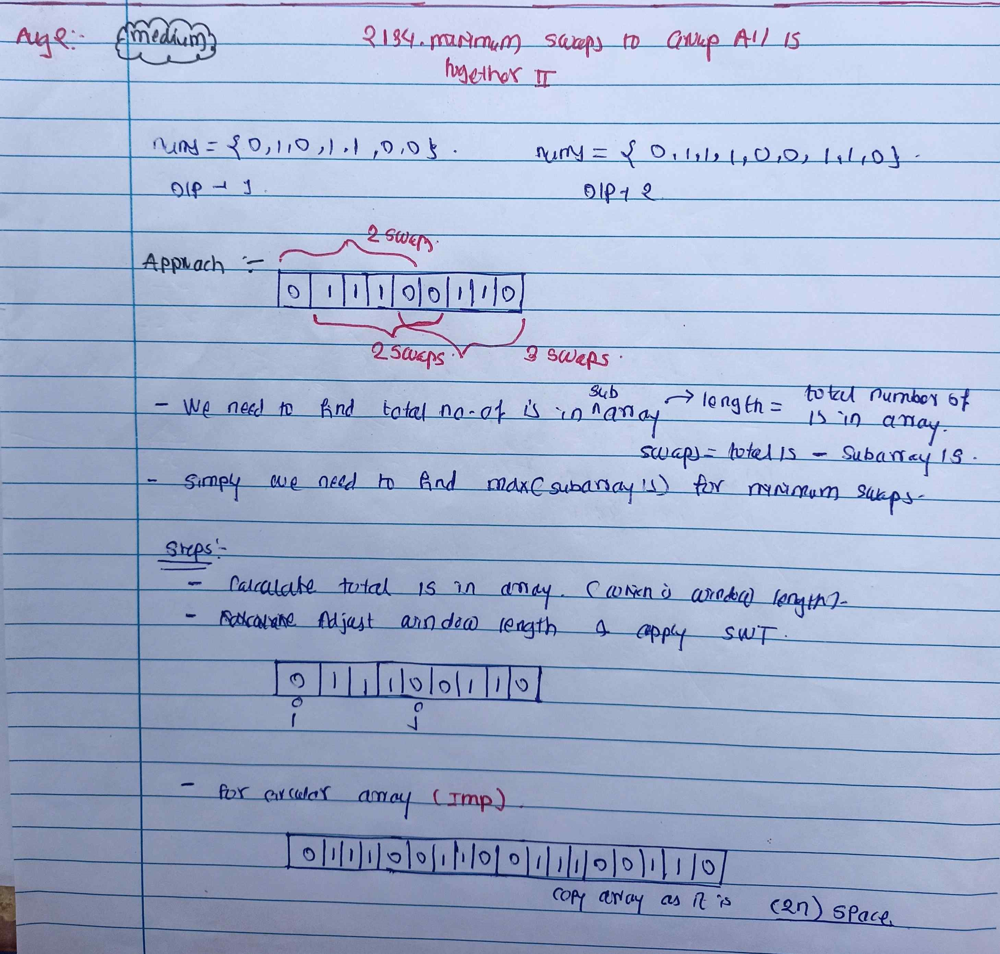

<!-- August-2-->

# LeetCode - [2134. Minimum Swaps to Group All 1's Together II](https://leetcode.com/problems/minimum-swaps-to-group-all-1s-together-ii/description/)

**Difficulty:** Medium

**Category:**  Array

---

## Dry Run

<p align="middle">
   
</p>

---

## Solution

```java
class Solution {
    public int minSwaps(int[] nums) {
        int n = nums.length;
        int[] newNum = new int[2 * n];
        int k = 0;
        for (int i = 0; i < 2 * n; i++) {
            newNum[i] = nums[k % n];
            k++;
        }

        int total1s = 0 ;
        for (int num : nums) {
            if (num == 1) {
                total1s++;
            }
        }

        int maxSubArray1 =0 ;
        int currSubArray1 =0 ;

        for(int i=0 ;i<total1s;i++){
            if(newNum[i]==1){
                currSubArray1++ ;
            }
        }

        maxSubArray1 = Math.max(maxSubArray1,currSubArray1);

        int j = 0 ;
        for (int i =total1s; i < 2*n ; i++) {
            if(newNum[i]==1){
                currSubArray1++;
            }
            if(newNum[j]==1){
                currSubArray1--;
            }
            maxSubArray1 = Math.max(maxSubArray1,currSubArray1);
            j++;
        }
        //System.out.println(Arrays.toString(newNum));
        return total1s-maxSubArray1;

    }
}


// Optimal Solution
class Solution {
    public int minSwaps(int[] nums) {
        int n = nums.length;
        int totalOnes = 0;

        // Count total number of 1's
        for (int num : nums) {
            totalOnes += num;
        }

        // Edge cases
        if (totalOnes == 0 || totalOnes == n) return 0;

        int currentOnes = 0;

        // Count 1's in the first window of size totalOnes
        for (int i = 0; i < totalOnes; i++) {
            currentOnes += nums[i];
        }

        int maxOnes = currentOnes;

        // Use two pointers to slide the window
        for (int i = 0; i < n; i++) {
            currentOnes -= nums[i];
            currentOnes += nums[(i + totalOnes) % n];
            maxOnes = Math.max(maxOnes, currentOnes);
        }

        return totalOnes - maxOnes;
    }
}
```
