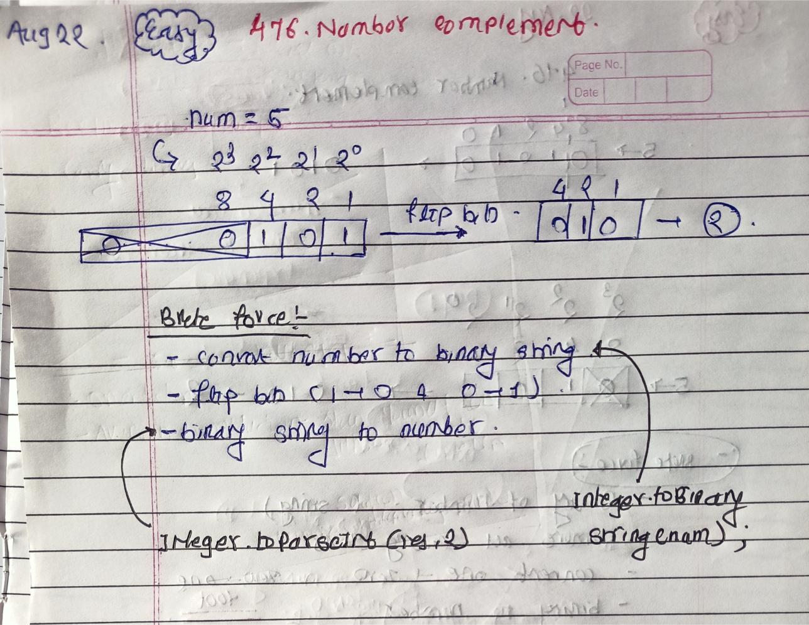

<!-- August-22-->

# LeetCode - [476. Number Complement](https://leetcode.com/problems/number-complement/description/)

**Difficulty:** Easy

**Category:**  String

---

## Dry Run

<p align="middle">
   
</p>

---

## Solution

```java
//Using Recursion
class Solution {
    private int solve(int n ,int currA, int clipB){
        if(currA==n){
            return 0 ;
        }

        if(currA>n){
            return 1001;
        }

        int copyAndPaste = 1 + 1 + solve(n, currA + currA,currA);
        int paste = 1 + solve(n, currA+clipB,clipB);

        return Math.min(copyAndPaste,paste);
    }
    public int minSteps(int n) {
        if(n==1){
            return 0 ;
        }
        int result = 1 + solve(n,1,1);
        return result;
    }
}
```
