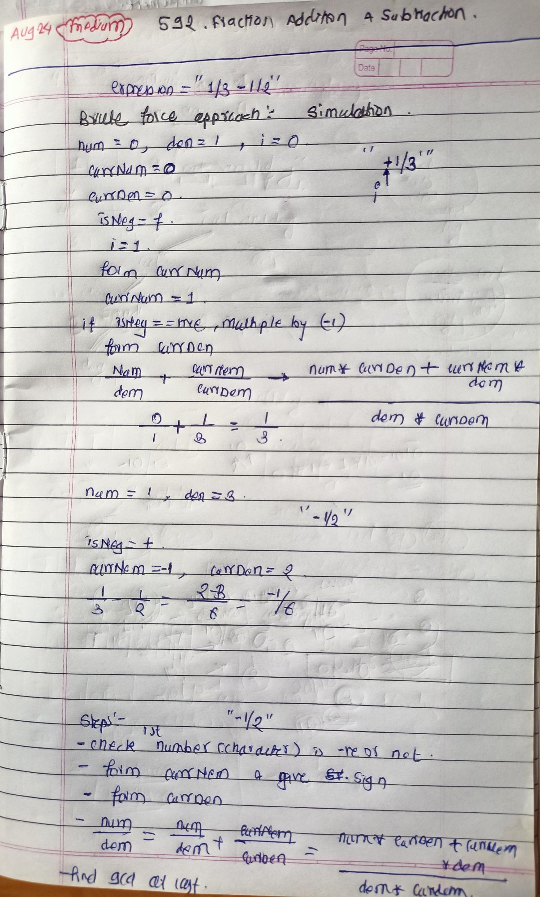

<!-- August-23-->

# LeetCode - [592. Fraction Addition and Subtraction](https://leetcode.com/problems/fraction-addition-and-subtraction/description/)

**Difficulty:** Medium

**Category:**  String, Simulation

---

## Dry Run

<p align="middle">
   
</p>

---

## Solution

```java
 class Solution {

    // a should be larger than b(Euclidean algorithm)
    private int calculateGDC(int a, int b) {
        if (b == 0) {
            return a;
        }
        return calculateGDC(b, a % b);
    }

    public String fractionAddition(String expression) {
        int num = 0;
        int den = 1;
        int i = 0;
        int n = expression.length();
        while (i < n) {       // "-10/13" or "10/13"
            int currNum = 0;
            int currDen = 0;
            boolean isNegative = expression.charAt(i) == '-'; // check first character is -ve or not

            // go to next character if there is sign
            if (expression.charAt(i) == '+' || expression.charAt(i) == '-') {
                i++;
            }

            // form currNum
            while (i < n && Character.isDigit(expression.charAt(i))) {
                currNum = (currNum * 10) + (expression.charAt(i) - '0');
                i++;
            }
            if (isNegative) {
                currNum *= -1;
            }
            i++;

            // form currden
            while (i < n && Character.isDigit(expression.charAt(i))) {
                currDen = (currDen * 10) + (expression.charAt(i) - '0');
                i++;
            }

            num = num * currDen + currNum * den;
            den = currDen * den;
        }

        int gdc = this.calculateGDC(Math.max(Math.abs(num), den), Math.min(Math.abs(num), den));
        num /= gdc;
        den /= gdc;

        return num + "/" + den;
    }
}
```
