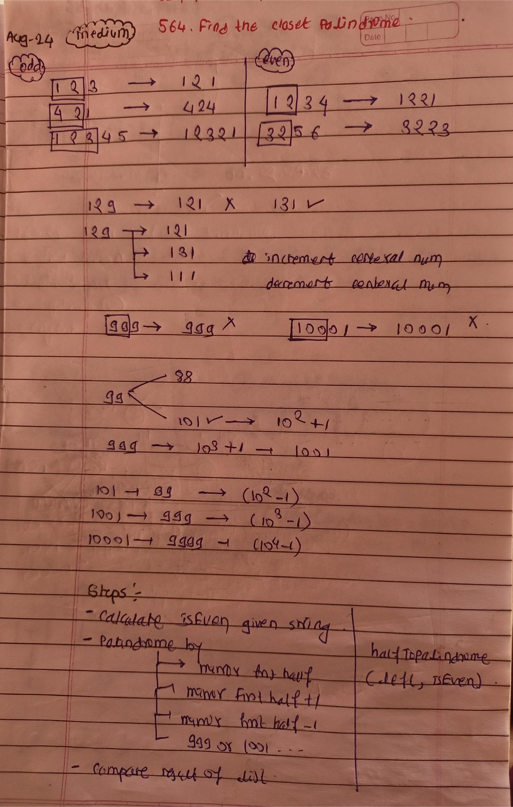

<!-- August-24-->

# LeetCode - [564. Find the Closest Palindrome](https://leetcode.com/problems/find-the-closest-palindrome/)

**Difficulty:** Hard

**Category:**  String, Numbers

---

## Dry Run

<p align="middle">
   
</p>

---

## Solution

```java
  class Solution {

    private long halfToPalindrome(Long left, boolean isEven) {
        long ans = left;

        if (!isEven) {
            left /= 10;
        }

        while (left > 0) {
            ans = (ans * 10) + (left % 10);
            left /= 10;
        }

        return ans;
    }

    public String nearestPalindromic(String str) {
        int n = str.length();
        boolean isEven = n % 2 == 0;
        String leftStr = str.substring(0, isEven ? n / 2 : n / 2 + 1);
        long left = Long.parseLong(leftStr);
        /*
         * Cases: Palindrome by
         * - mirror first half
         * - mirror first half +1
         * - mirror firt half -1
         * - 999 or 1001
         */

        List<Long> possibleResult = new ArrayList<>();
        possibleResult.add(this.halfToPalindrome(left, isEven));
        possibleResult.add(this.halfToPalindrome(left + 1, isEven));
        possibleResult.add(this.halfToPalindrome(left - 1, isEven));
        possibleResult.add((long) Math.pow(10, n) + 1);
        possibleResult.add((long) Math.pow(10, n - 1) - 1);

        long ans = -1;
        long diff = Long.MAX_VALUE;
        long originalNum = Long.parseLong(str);
        for (Long value : possibleResult) {
            if (value == originalNum) {
                continue;
            }

            if (Math.abs(originalNum - value) < diff) {
                diff = Math.abs(originalNum - value);
                ans = value;
            } else if (Math.abs(originalNum - value) == diff) {
                ans = Math.min(value, ans);
            }
        }

        return String.valueOf(ans);
    }
}
```
