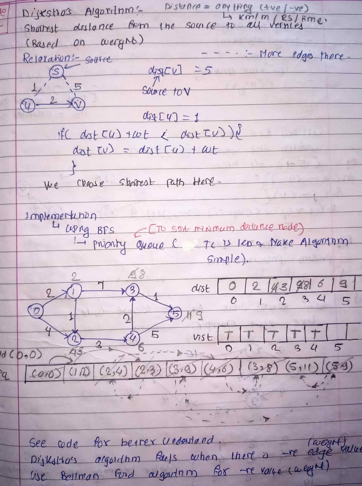

<!-- August-28-->

# LeetCode - [1905. Count Sub Islands](https://leetcode.com/problems/count-sub-islands/description/)

**Difficulty:** Medium

**Category:**  DFS

---

## Dry Run

<p align="middle">
   
</p>

---

## Solution

```java
/*
 Time Complicity : O(m×n)
 Space Complicity : O(m×n)
*/
// class Pair {
//     int i;
//     int j;

//     public Pair(int i, int j) {
//         this.i = i;
//         this.j = j;
//     }
// }

// class Solution {

//     int m;
//     int n;

//     int[][] directions = { { 1, 0 }, { -1, 0 }, { 0, 1 }, { 0, -1 } };

//     private void solve(int[][] grid2, int i, int j, List<Pair> pairs) {

//         grid2[i][j] = 0;
//         pairs.add(new Pair(i, j));
//         for (int[] dir : directions) {
//             int new_i = i + dir[0];
//             int new_j = j + dir[1];

//             if (new_i >= 0 && new_i < m && new_j >= 0 && new_j < n && grid2[new_i][new_j] == 1) {
//                 solve(grid2, new_i, new_j, pairs);
//             }
//         }
//     }

//     public int countSubIslands(int[][] grid1, int[][] grid2) {
//         m = grid1.length;
//         n = grid1[0].length;
//         int ans = 0;
//         for (int i = 0; i < m; i++) {
//             for (int j = 0; j < n; j++) {
//                 if (grid2[i][j] == 1) {
//                     List<Pair> pairs = new ArrayList<>();
//                     solve(grid2, i, j, pairs);
//                     boolean flag = false;
//                     for (Pair pair : pairs) {
//                         if (grid1[pair.i][pair.j] == 0) {
//                             flag = true;
//                             break;
//                         }
//                     }
//                     ans += !flag ? 1 : 0;
//                 }
//             }
//         }

//         return ans;
//     }
// }


// Without any space
class Solution {

    int m;
    int n;
    int[][] directions = { { 1, 0 }, { -1, 0 }, { 0, 1 }, { 0, -1 } };

    private boolean dfs(int[][] grid1, int[][] grid2, int i, int j) {
        if (i < 0 || i >= m || j < 0 || j >= n || grid2[i][j] == 0) {
            return true;
        }

        // Mark the cell as visited
        grid2[i][j] = 0;

        // Check if this cell is part of a sub-island
        boolean isSubIsland = grid1[i][j] == 1;

        // Explore the four directions
        for (int[] dir : directions) {
            int new_i = i + dir[0];
            int new_j = j + dir[1];
            isSubIsland = isSubIsland && dfs(grid1, grid2, new_i, new_j);
        }

        return isSubIsland;
    }

    public int countSubIslands(int[][] grid1, int[][] grid2) {
        m = grid1.length;
        n = grid1[0].length;
        int ans = 0;

        for (int i = 0; i < m; i++) {
            for (int j = 0; j < n; j++) {
                if (grid2[i][j] == 1) {
                    if (dfs(grid1, grid2, i, j)) {
                        ans++;
                    }
                }
            }
        }

        return ans;
    }
}

```
