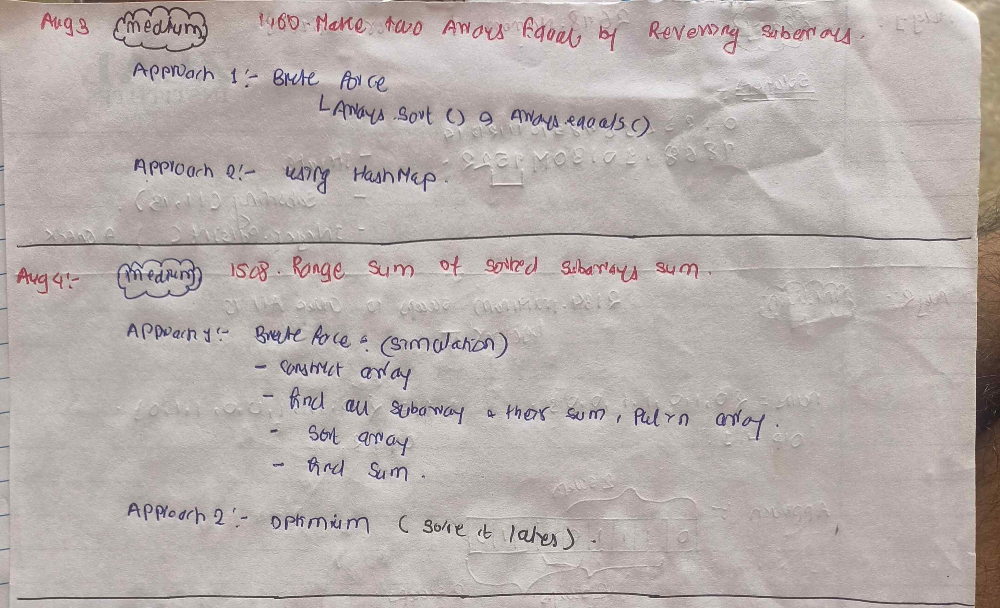

<!-- August-3_4-->

# LeetCode - [1460. Make Two Arrays Equal by Reversing Subarrays](https://leetcode.com/problems/make-two-arrays-equal-by-reversing-subarrays/description/)

**Difficulty:** Easy

**Category:**  Array, Sorting

---

## Dry Run

<p align="middle">
   
</p>

---

## Solution

```java
//Brute Force :
// class Solution {
//     public boolean canBeEqual(int[] target, int[] arr) {
//        Arrays.sort(target);
//        Arrays.sort(arr);
//        return Arrays.equals(target,arr);
//     }
// }

//Optimum Solution:
class Solution {
    public boolean canBeEqual(int[] target, int[] arr) {
        Map<Integer, Integer> targetMap = new HashMap<>();
        for (int num : target) {
            targetMap.put(num, targetMap.getOrDefault(num, 0) + 1);
        }

        for (int num : arr) {
            if (!targetMap.containsKey(num)) {
                return false;
            }
            targetMap.put(num, targetMap.get(num) - 1);
            if (targetMap.get(num) == 0) {
                targetMap.remove(num);
            }
        }
        return true;
    }
}
```
---

<!-- August-3_4-->

# LeetCode - [1508. Range Sum of Sorted Subarray Sums](https://leetcode.com/problems/range-sum-of-sorted-subarray-sums/description/)

**Difficulty:** Medium

**Category:**  Array, Sorting

---

## Solution

```java
class Solution {
    public int rangeSum(int[] nums, int n, int left, int right) {

        final int MOD = (int) Math.pow(10, 9) + 7;
        int[] temp = new int[n * (n + 1) / 2];
        int idx = 0;
        for (int i = 0; i < n; i++) {
            int sum = 0;
            for (int j = i; j < n; j++) {
                sum += nums[j];
                temp[idx++] = sum;
            }
        }

        Arrays.sort(temp);

        int ans = 0;
        for (int i = left - 1; i <= right - 1; i++) {
            ans = (ans + temp[i]) % MOD;
        }

        return ans;
    }
}
```