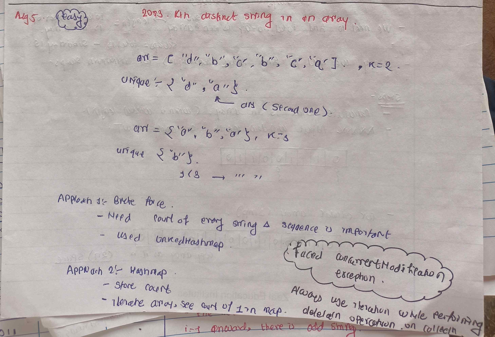

<!-- August-5-->

# LeetCode - [2053. Kth Distinct String in an Array](https://leetcode.com/problems/kth-distinct-string-in-an-array/description/)

**Difficulty:** Easy

**Category:**  LinkedHashMap, HashMap

---

## Dry Run

<p align="middle">
   
</p>

---

## Solution

```java

//Brute Force : 
// class Solution {
//      public String kthDistinct(String[] arr, int k) {

//         Map<String, Integer> map = new LinkedHashMap<>();
//         for (String str : arr) {
//             map.put(str, map.getOrDefault(str, 0) + 1);
//         }

//         Iterator<Map.Entry<String, Integer>> iterator = map.entrySet().iterator();

//         while (iterator.hasNext()) {
//             Map.Entry<String, Integer> entry = iterator.next();
//             if (entry.getValue() > 1) {
//                 iterator.remove();
//             }
//         }


//         if (map.size() < k) {
//             return "";
//         }

//         String ans = "";

//         for (String key : map.keySet()) {
//             if (k == 0) {
//                 break;
//             }
//             ans = key;
//             k--;
//         }

//         return ans;

//     }
// }

class Solution {
    public String kthDistinct(String[] arr, int k) {

        Map<String, Integer> map = new HashMap<>();
        for (String str : arr) {
            map.put(str, map.getOrDefault(str, 0) + 1);
        }


        String ans ="" ;
        int count =0 ;
        for (String str : arr) {
            if(map.get(str)==1){
                ans = str;
                count++;
            }

            if(count==k){
                return ans ;
            }
        }

        return "";

    }
}
```
