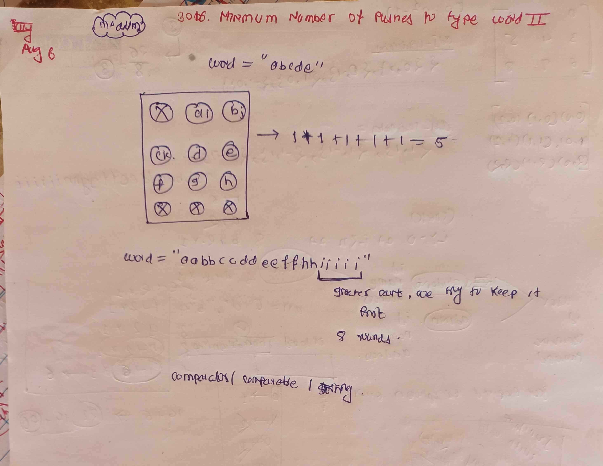

<!-- August-6-->

# LeetCode - [3016. Minimum Number of Pushes to Type Word II](https://leetcode.com/problems/minimum-number-of-pushes-to-type-word-ii/description/)

**Difficulty:** Medium

**Category:**  PriorityQueue
---

## Dry Run

<p align="middle">
   
</p>

---

## Solution

```java
class Solution {
    // Approach 1 : Using HashMap and List
    // public int minimumPushes(String word) {
    // Map<Character, Integer> map = new HashMap<>();
    // for (char ch : word.toCharArray()) {
    // map.put(ch, map.getOrDefault(ch, 0) + 1);
    // }

    // List<Character> list = new ArrayList<>(map.keySet());
    // Collections.sort(list, (a, b) -> map.get(b) - map.get(a));

    // int ans = 0;
    // int mul = 1;
    // int count = 0;

    // for (char ch : list) {
    // ans += map.get(ch) * mul;
    // count++;
    // if (count == 8) {
    // count = 0;
    // mul++;
    // }
    // }
    // return ans;
    // }

    // Approach 2 : Using array only
    public int minimumPushes(String word) {
        // Step 1: Count the frequency of each character in the word
        int[] arr = new int[26];
        for (int i = 0; i < word.length(); i++) {
            arr[word.charAt(i) - 'a']++;
        }

        // Step 2: Sort the frequency array in descending order
        Arrays.sort(arr);

        int i = 25; // Start from the highest frequency character
        int count = 0; // Counts the number of characters assigned to the current key
        int start = 1; // Represents the key press multiplier (1 for the first 8 characters, 2 for the
        // next 8, etc.)
        int ans = 0; // Total number of key presses

        // Step 3: Calculate the total number of key presses required
        while (i >= 0 && arr[i] != 0) {
            ans += (start * arr[i]);
            count++;
            if (count == 8) { // Move to the next key after every 8 characters
                start++;
                count = 0;
            }
            i--;
        }

        return ans;
    }
}
```
