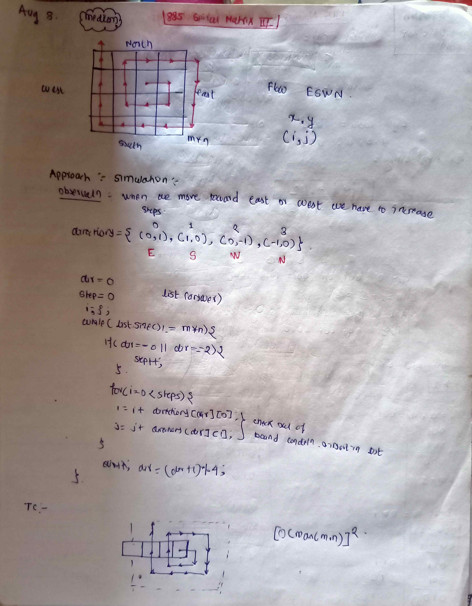

<!-- August-8-->

# LeetCode - [885. Spiral Matrix III](https://leetcode.com/problems/spiral-matrix-iii/description/)

**Difficulty:** Medium

**Category:**  2D Array

---

## Dry Run

<p align="middle">
   
</p>

---

## Solution

```java
class Solution {
    public int[][] spiralMatrixIII(int rows, int cols, int rStart, int cStart) {
        List<int[]> temp = new ArrayList<>();
        int[][] directions = { { 0, 1 }, { 1, 0 }, { 0, -1 }, { -1, 0 } };
        int steps = 0;
        int dir = 0;
        int i = rStart;
        int j = cStart;
        temp.add(new int[] { i, j });
        while (temp.size() != rows * cols) {
            if (dir == 0 || dir == 2) {
                steps++;
            }
            for (int k = 0; k < steps; k++) {
                i = i + directions[dir][0];
                j = j + directions[dir][1];
                if (i >= 0 && i < rows && j >= 0 && j < cols) {
                    temp.add(new int[] { i, j });
                }
            }
            dir = (dir + 1) % 4;
        }

        int[][] ans = new int[rows * cols][2];

        int idx = 0;
        for (int[] row : temp) {
            ans[idx++] = row;
        }

        return ans;
    }
}
```
