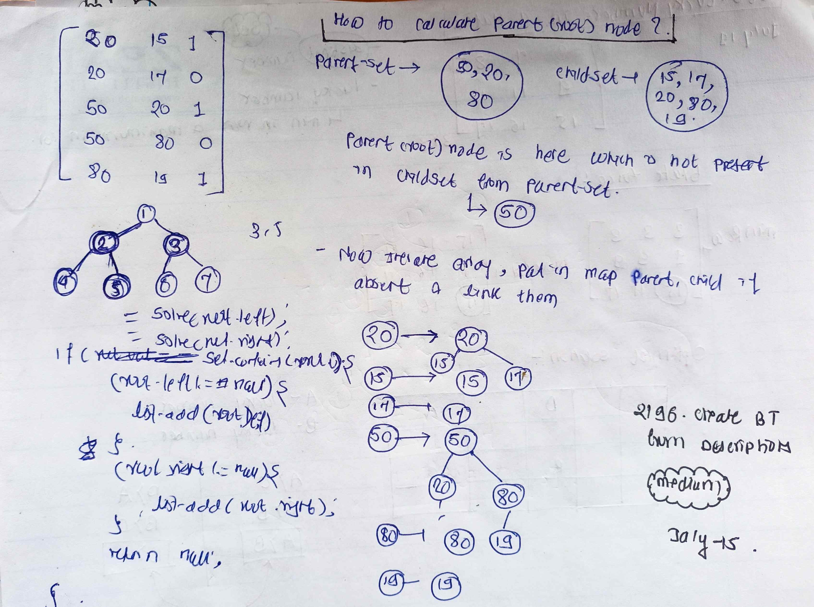

# LeetCode - [2196. Create Binary Tree From Descriptions](https://leetcode.com/problems/create-binary-tree-from-descriptions/description/)

**Difficulty:** Medium

**Category:** Tree, HashMap

---

## Dry Run

<p align="middle">
   
</p>

---

## Solution

```java
//Using HashMap and Set
class Solution {
    public TreeNode createBinaryTree(int[][] descriptions) {
        Set<Integer> parentSet = new HashSet<>();
        Set<Integer> childSet = new HashSet<>();
        Map<Integer, TreeNode> nodes = new HashMap<>();
        for (int[] row : descriptions) {
            int parent = row[0];
            int child = row[1];
            parentSet.add(parent);
            childSet.add(child);
        }

        int parentNode = -1;
        for (int parent : parentSet) {
            if (!childSet.contains(parent)) {
                parentNode = parent;
                break;
            }
        }

        for (int[] row : descriptions) {
            int parent = row[0];
            int child = row[1];
            nodes.computeIfAbsent(parent, (k) -> new TreeNode(parent));
            nodes.computeIfAbsent(child, (k) -> new TreeNode(child));
            boolean isParent = row[2] == 1;
            if (isParent) {
                nodes.get(parent).left = nodes.get(child);
            } else {
                nodes.get(parent).right = nodes.get(child);
            }

        }
        return nodes.get(parentNode);
    }
}
```
