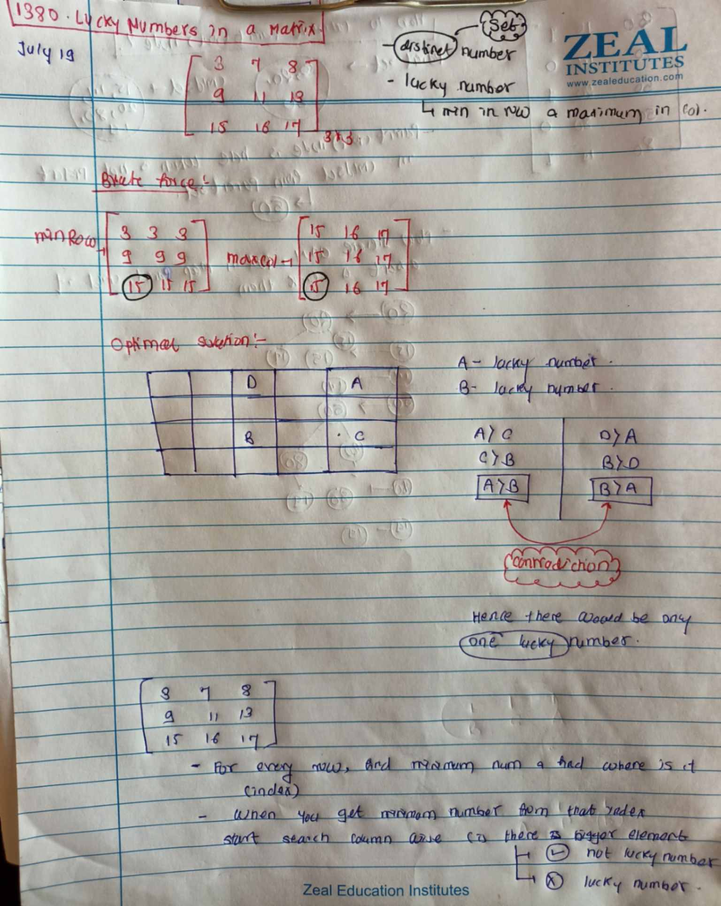

# LeetCode - [2096. Step-By-Step Directions From a Binary Tree Node to Another](https://leetcode.com/problems/step-by-step-directions-from-a-binary-tree-node-to-another/description/)

**Difficulty:** Medium

**Category:** Tree, BFS, DFS, Graph

---

## Dry Run

<p align="middle">
   
</p>

---

## Solution

```java
   //Using bfs
    class Solution {
        public String getDirections(TreeNode root, int startValue, int destValue) {
            return helper(root,startValue,destValue);
        }
        public TreeNode findNode(int value, TreeNode root){
            if(root == null){
                return null;
            }
            if(root.val == value){
                return root;
            }

            TreeNode left = findNode(value,root.left);

            if(left != null){
                return left;
            }
            return findNode(value,root.right);
        }
        public String helper(TreeNode root, int start, int end){
            HashMap<TreeNode,TreeNode> parentMap = new HashMap<>();
            function(root,null,parentMap);
            Queue<Pair> queue = new LinkedList<>();

            TreeNode startNode = findNode(start,root);
            TreeNode endNode = findNode(end,root);
            queue.add(new Pair(startNode,""));
            Set<Integer> visited = new HashSet<>();

            while(!queue.isEmpty()){
                Pair rem = queue.poll();

                if(visited.contains(rem.node.val)){
                    continue;
                }
                if(rem.node.val == end){
                    return rem.psf;
                }

                visited.add(rem.node.val);

                if(rem.node.left != null && !visited.contains(rem.node.left.val)){
                    queue.add(new Pair(rem.node.left,rem.psf + "L"));
                }
                if(rem.node.right != null && !visited.contains(rem.node.right.val)){
                    queue.add(new Pair(rem.node.right,rem.psf + "R"));
                }
                TreeNode parentN = parentMap.get(rem.node);
                if(parentN!= null && !visited.contains(parentN.val)){
                    queue.add(new Pair(parentN,rem.psf + "U"));
                }
            }
            return "";

        }
        public void function(TreeNode root,TreeNode parent, HashMap<TreeNode,TreeNode> parentMap){
            if(root == null){
                return;
            }

            parentMap.put(root,parent);
            function(root.left,root,parentMap);
            function(root.right,root,parentMap);

        }
        class Pair{
            TreeNode node;
            String psf;

            public Pair(TreeNode node, String psf){
                this.node = node;
                this.psf = psf;
            }
        }
    }
```
