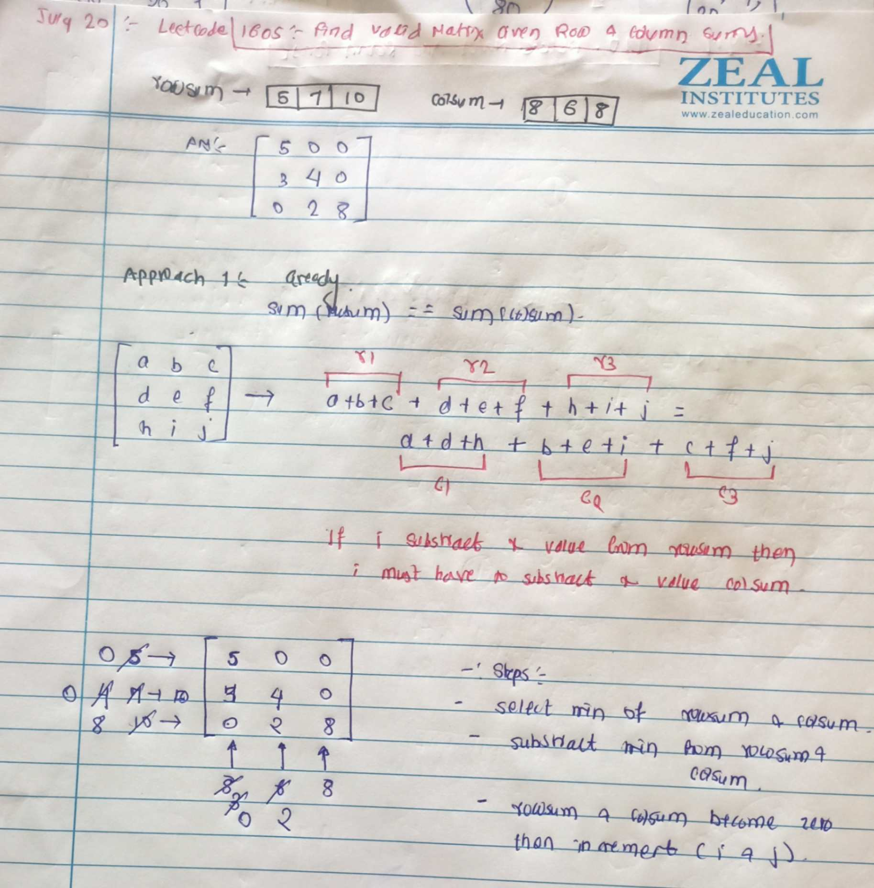

# LeetCode - [1605. Find Valid Matrix Given Row and Column Sums](https://leetcode.com/problems/find-valid-matrix-given-row-and-column-sums/description/)

**Difficulty:** Medium

**Category:** Multi-dimensional Arrays, Greedy

---

## Dry Run

<p align="middle">
   
</p>

---

## Solution

```java
// Approach 1 : 
class Solution {
    public int[][] restoreMatrix(int[] rowSum, int[] colSum) {
        int m = rowSum.length;
        int n = colSum.length;
        int[][] ans = new int[m][n];
        int i = 0;
        int j = 0;

        while (i < m && j < n) {
            int min = Math.min(rowSum[i], colSum[j]);
            ans[i][j] = min;
            rowSum[i] = Math.abs(ans[i][j] - rowSum[i]);
            colSum[j] = Math.abs(ans[i][j] - colSum[j]);
            if (rowSum[i] == 0) {
                i++;
            }
            if (colSum[j] == 0) {
                j++;
            }
        }
        return ans;
    }
}
```
