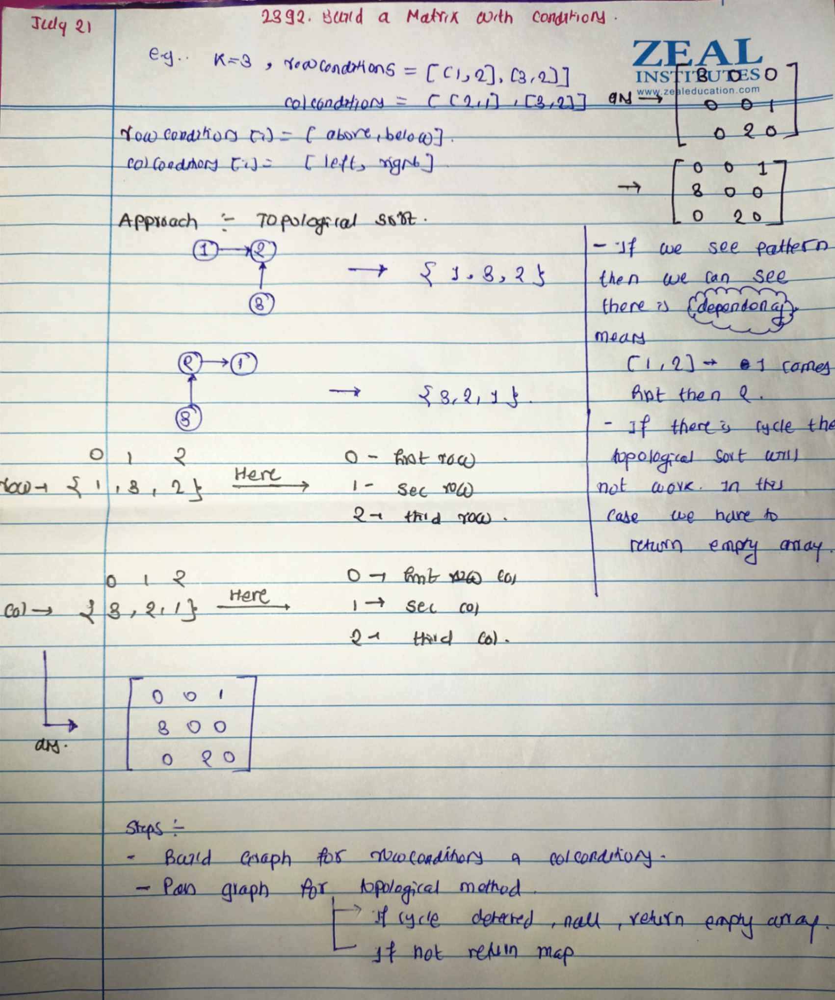

# LeetCode - [2392. Build a Matrix With Conditions](https://leetcode.com/problems/build-a-matrix-with-conditions/)

**Difficulty:** Hard

**Category:** Graph, Topological Sort

---

## Dry Run



---

## Solution

```java
// Approach 1 : 
class Solution {
    private Map<Integer , List<Integer>> buildGraph(int[][] mat){
        Map<Integer , List<Integer>> adjacencyList = new HashMap<>();
        for(int [] row : mat){
            int src = row[0];
            int dest = row[1];
            adjacencyList.putIfAbsent(src , new LinkedList<>());
            adjacencyList.putIfAbsent(dest , new LinkedList<>());
            adjacencyList.get(src).add(dest);
        }
        return adjacencyList ;
    }

    private boolean topSortUtil(Map<Integer, List<Integer>> graph, int curr, Set<Integer> vis, Set<Integer> recStack, Stack<Integer> stack) {
        // Mark the current node as visited and add it to the recursion stack
        vis.add(curr);
        recStack.add(curr);

        // Explore all the adjacent nodes
        List<Integer> neighbors = graph.getOrDefault(curr, Collections.emptyList());
        for (int dest : neighbors) {
            if (!vis.contains(dest)) {
                // Recur for the destination node
                if (!topSortUtil(graph, dest, vis, recStack, stack)) {
                    return false; // If a cycle is detected
                }
            } else if (recStack.contains(dest)) {
                // If the destination node is in the recursion stack, there is a cycle
                return false;
            }
        }

        // Remove the node from the recursion stack and push it to the stack
        recStack.remove(curr);
        stack.push(curr);
        return true;
    }

    // Method to perform topological sort
    private Map<Integer,Integer> topSort(Map<Integer, List<Integer>> graph, int v) {
        Set<Integer> vis = new HashSet<>();
        Set<Integer> recStack = new HashSet<>();
        Stack<Integer> stack = new Stack<>();
        Map<Integer,Integer> result = new HashMap<>();

        for (int i = 1; i <= v; i++) {
            if (!vis.contains(i)) {
                if (!topSortUtil(graph, i, vis, recStack, stack)) {
                    return null; // Return null if a cycle is detected
                }
            }
        }

        // Collect the topological sort order
        int idx = 0 ;
        while (!stack.isEmpty()) {
            result.put(stack.pop(), idx++);
        }
        return result;
    }

    public int[][] buildMatrix(int k, int[][] rowConditions, int[][] colConditions) {
        Map<Integer, List<Integer>> rowGraph = buildGraph(rowConditions);
        Map<Integer, List<Integer>> colGraph = buildGraph(colConditions);
        Map<Integer, Integer> rowMap = topSort(rowGraph, k);
        Map<Integer, Integer> colMap = topSort(colGraph, k);

        if(rowMap==null || colMap==null){
            return new int[0][0] ;
        }

        int [][] ans = new int[k][k];

        for(Map.Entry<Integer,Integer> entry : rowMap.entrySet()){
            Integer num = entry.getKey();
            Integer i = entry.getValue();
            Integer j = colMap.get(num);
            ans[i][j] = num ;
        }
        return ans ;
    }
}
```
