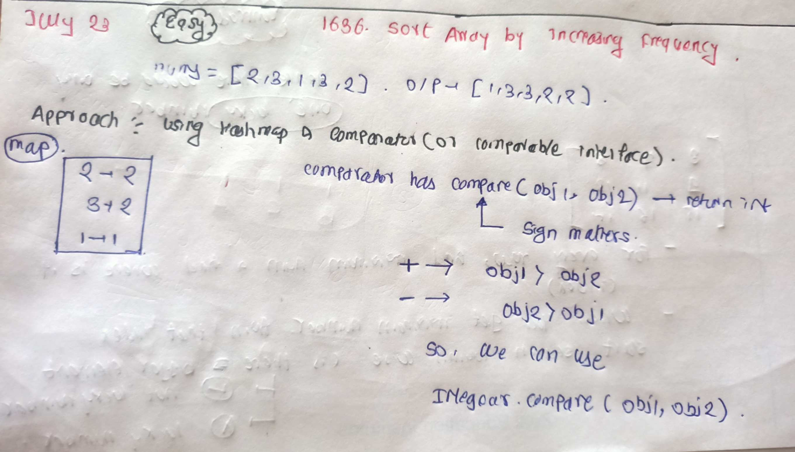

# LeetCode - [2418. Sort the People](https://leetcode.com/problems/sort-the-people/description/)

**Difficulty:** Easy

**Category:** Sorting, Comparators or Comparable

---

## Dry Run


<p align="middle">
   
</p>

---

## Solution

```java
class Solution {
    //Approach 1 :
    // class Pair implements Comparable<Pair> {
    // int height;
    // String name;

    // public Pair(int height, String name) {
    // this.height = height;
    // this.name = name;
    // }

    // @Override
    // public int compareTo(Pair p) {
    // return p.height - this.height;
    // }
    // }

    // public String[] sortPeople(String[] names, int[] heights) {
    // int n = names.length;
    // Queue<Pair> queue = new PriorityQueue<>();
    // for (int i = 0; i < n; i++) {
    // String name = names[i];
    // int height = heights[i];
    // queue.add(new Pair(height, name));
    // }

    // String[] ans = new String[n];
    // int idx = 0;

    // while (!queue.isEmpty()) {
    // Pair pair = queue.poll();
    // ans[idx++] = pair.name;
    // }
    // return ans;
    // }
    //Approach 2 :
    public String[] sortPeople(String[] names, int[] heights) {
        TreeMap<Integer, String> map = new TreeMap<>();
        for (int i = 0; i < names.length; i++) {
            map.put(heights[i], names[i]);
        }
        int j = names.length - 1;
        for (Map.Entry<Integer, String> entry : map.entrySet()) {
            names[j] = entry.getValue();
            j--;
        }
        return names;
    }
}
```
---

# LeetCode - [1636. Sort Array by Increasing Frequency](https://leetcode.com/problems/sort-array-by-increasing-frequency/description/)

**Difficulty:** Easy

**Category:** Sorting, Comparators or Comparable

---

## Dry Run


<p align="middle">
   
</p>

---

## Solution

```java
class Solution {
    public int[] frequencySort(int[] nums) {
        Map<Integer, Integer> map = new HashMap<>();
        for (int num : nums) {
            map.put(num, map.getOrDefault(num, 0) + 1);
        }

        List<Integer> list = new ArrayList<>(map.keySet());
        Collections.sort(list, (a, b) -> {
            if (Objects.equals(map.get(a), map.get(b))) {
                return Integer.compare(b ,a);
            } else {
                return Integer.compare(map.get(a) ,map.get(b));
            }
        });

        int[] ans = new int[nums.length];
        int idx = 0;
        for (int num : list) {
            int value = map.get(num);
            while (value != 0) {
                ans[idx++] = num;
                value--;
            }
        }
        return ans;

    }
}
```
