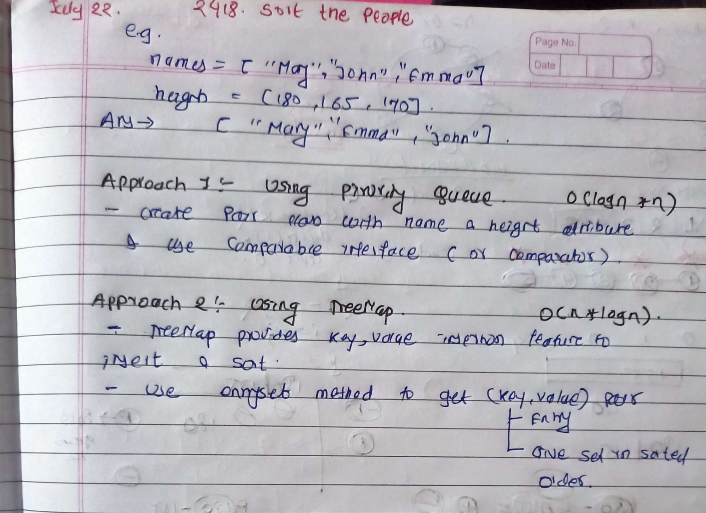
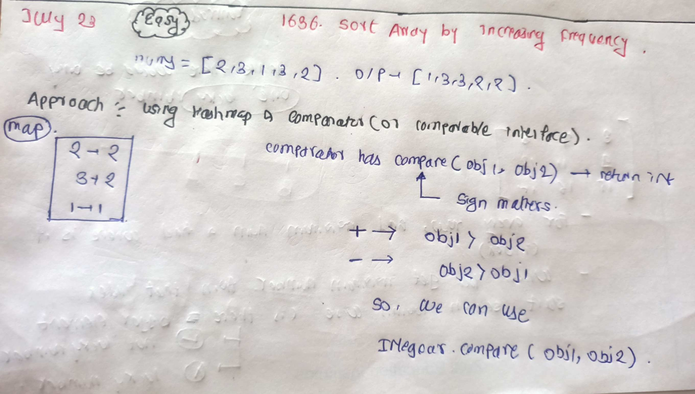
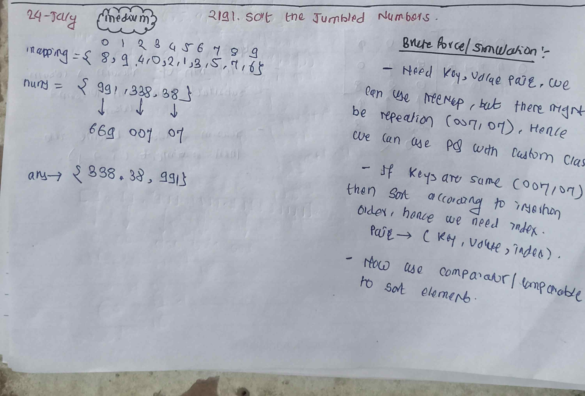

<!-- July 22 -->

# LeetCode - [2418. Sort the People](https://leetcode.com/problems/sort-the-people/description/)

**Difficulty:** Easy

**Category:** Sorting, Comparators or Comparable

---

## Dry Run

<p align="middle">
   
</p>

---

## Solution

```java
class Solution {
    //Approach 1 :
    // class Pair implements Comparable<Pair> {
    // int height;
    // String name;

    // public Pair(int height, String name) {
    // this.height = height;
    // this.name = name;
    // }

    // @Override
    // public int compareTo(Pair p) {
    // return p.height - this.height;
    // }
    // }

    // public String[] sortPeople(String[] names, int[] heights) {
    // int n = names.length;
    // Queue<Pair> queue = new PriorityQueue<>();
    // for (int i = 0; i < n; i++) {
    // String name = names[i];
    // int height = heights[i];
    // queue.add(new Pair(height, name));
    // }

    // String[] ans = new String[n];
    // int idx = 0;

    // while (!queue.isEmpty()) {
    // Pair pair = queue.poll();
    // ans[idx++] = pair.name;
    // }
    // return ans;
    // }
    //Approach 2 :
    public String[] sortPeople(String[] names, int[] heights) {
        TreeMap<Integer, String> map = new TreeMap<>();
        for (int i = 0; i < names.length; i++) {
            map.put(heights[i], names[i]);
        }
        int j = names.length - 1;
        for (Map.Entry<Integer, String> entry : map.entrySet()) {
            names[j] = entry.getValue();
            j--;
        }
        return names;
    }
}
```

---

<!-- July 23 -->

# LeetCode - [1636. Sort Array by Increasing Frequency](https://leetcode.com/problems/sort-array-by-increasing-frequency/description/)

**Difficulty:** Easy

**Category:** Sorting, Comparators or Comparable

---

## Dry Run

<p align="middle">
   
</p>

---

## Solution

```java
class Solution {
    public int[] frequencySort(int[] nums) {
        Map<Integer, Integer> map = new HashMap<>();
        for (int num : nums) {
            map.put(num, map.getOrDefault(num, 0) + 1);
        }

        List<Integer> list = new ArrayList<>(map.keySet());
        Collections.sort(list, (a, b) -> {
            if (Objects.equals(map.get(a), map.get(b))) {
                return Integer.compare(b ,a);
            } else {
                return Integer.compare(map.get(a) ,map.get(b));
            }
        });

        int[] ans = new int[nums.length];
        int idx = 0;
        for (int num : list) {
            int value = map.get(num);
            while (value != 0) {
                ans[idx++] = num;
                value--;
            }
        }
        return ans;

    }
}
```

<!-- July 24 -->

# LeetCode - [2191. Sort the Jumbled Numbers](https://leetcode.com/problems/sort-the-jumbled-numbers/description/)

**Difficulty:** Easy

**Category:** Sorting, Comparators or Comparable

---

## Dry Run

<p align="middle">
   
</p>

---

## Solution

<!-- Good and pratical example for Comparators or Comparable -->

```java
class Solution {
    class Pair implements Comparable<Pair> {
        int key;
        int value;
        int index;

        public Pair(int key, int value, int index) {
            this.key = key;
            this.value = value;
            this.index = index;
        }

        @Override
        public int compareTo(Pair o) {
            if (this.key != o.key) {   //IMP
                return Integer.compare(this.key, o.key);
            } else {
                return Integer.compare(this.index, o.index);
            }
        }

        @Override
        public String toString() {
            return "Pair{" +
                    "key=" + key +
                    ", value=" + value +
                    '}';
        }
    }

    public int[] sortJumbled(int[] mapping, int[] nums) {
        int n = nums.length;

        Queue<Pair> queue = new PriorityQueue<>();

        for (int i = 0; i < n; i++) {
            int num = nums[i];
            int temp = num;
            int key = 0;
            int pow = 0;  // place value

            if (temp == 0) {
                key = mapping[temp];
            } else {
                while (temp != 0) {
                    int rem = temp % 10;
                    key = mapping[rem] * (int) Math.pow(10, pow) + key;
                    temp = temp / 10;
                    pow++;
                }
            }

            queue.add(new Pair(key, num, i));
        }
        int[] ans = new int[n];
        int idx = 0;

        while (!queue.isEmpty()) {
            Pair pair = queue.poll();
            ans[idx++] = pair.value;
        }
        return ans;
    }
}
```
