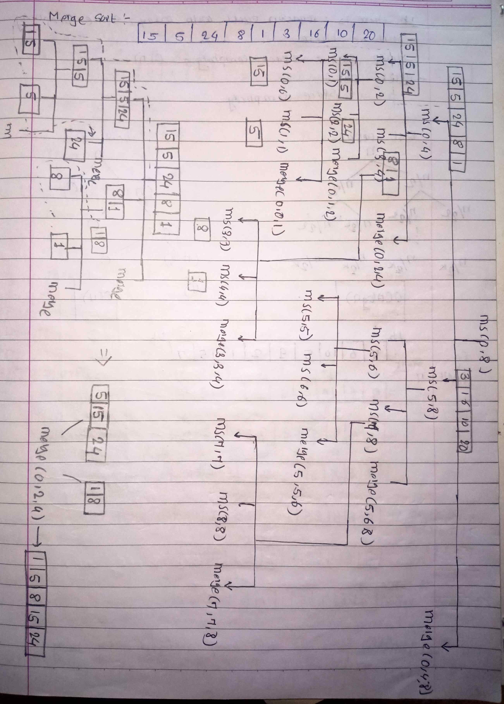

<!-- July 25 -->

# LeetCode - [912. Sort an Array](https://leetcode.com/problems/sort-an-array/description/)

**Difficulty:** Medium

**Category:** Sorting, Merge Sort

---

## Dry Run

<p align="middle">
   
</p>

---

## Solution

```java
class Solution {

    private void mergeSortUtil(int[] nums, int start, int end, int mid, int[] temp) {
        int i = start;
        int j = mid + 1;
        int idx = start;

        while (i <= mid && j <= end) {
            if (nums[i] <= nums[j]) {
                temp[idx++] = nums[i++];
            } else {
                temp[idx++] = nums[j++];
            }
        }

        while (i <= mid) {
            temp[idx++] = nums[i++];
        }

        while (j <= end) {
            temp[idx++] = nums[j++];
        }


        for (int k = start; k <= end; k++) {
            nums[k] = temp[k];
        }
    }

    private void mergeSort(int[] nums, int start, int end, int[] temp) {
        if (start < end) {
            int mid = start + (end - start) / 2;
            mergeSort(nums, start, mid, temp);
            mergeSort(nums, mid + 1, end, temp);
            mergeSortUtil(nums, start, end, mid, temp);
        }
    }

    public int[] sortArray(int[] nums) {
        int[] temp = new int[nums.length];
        mergeSort(nums, 0, nums.length - 1, temp);
        return nums;
    }
}

```
