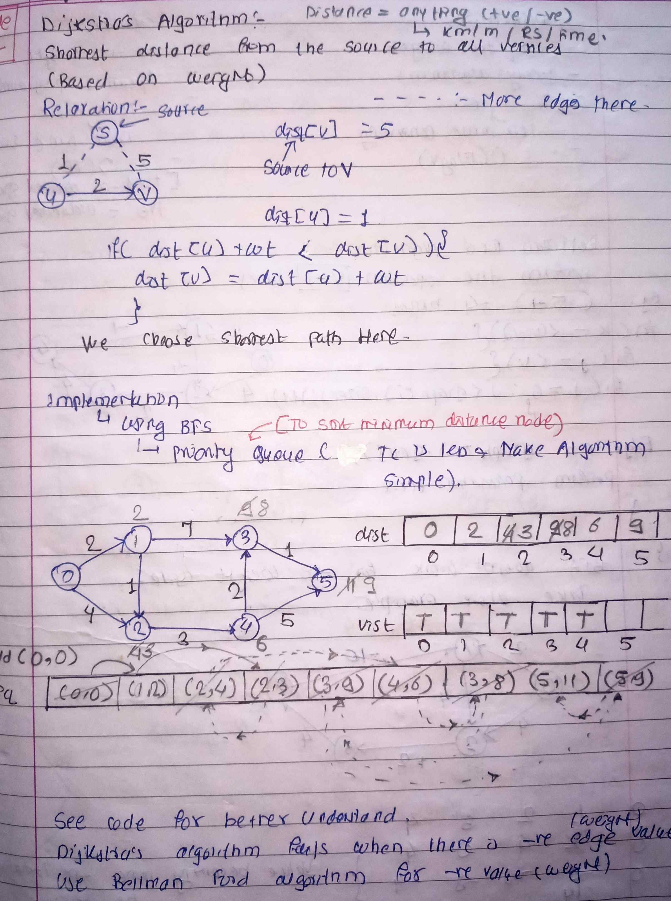

<!-- July 26 -->

# LeetCode - [1334. Find the City With the Smallest Number of Neighbors at a Threshold Distance](https://leetcode.com/problems/find-the-city-with-the-smallest-number-of-neighbors-at-a-threshold-distance/description/)

**Difficulty:** Medium

**Category:** Graph

---

## Dry Run

<p align="middle">
   
</p>

---

## Solution

```java
class Solution {
    public int findTheCity(int n, int[][] edges, int distanceThreshold) {
        List<List<int[]>> adj = new ArrayList<>();
        int whileCounter = n;
        while (whileCounter-- > 0)
            adj.add(new ArrayList<>());
        PriorityQueue<int[]> queue = new PriorityQueue<>(Comparator.comparingInt(a -> a[0]));
        for (int[] edge : edges) {
            int u = edge[0];
            int v = edge[1];
            int wt = edge[2];
            adj.get(u).add(new int[] { v, wt });
            adj.get(v).add(new int[] { u, wt });
        }
        int city = n;
        int ans = -1;
        for (int vertex = 0; vertex < n; vertex++) {
            int[] distanceDp = new int[n];
            Arrays.fill(distanceDp, (int) 1e9);
            distanceDp[vertex] = 0;
            queue.add(new int[] { 0, vertex });
            while (!queue.isEmpty()) {
                int[] parent = queue.remove();
                int parentNode = parent[1];
                int parentDistance = parent[0];
                for (int[] child : adj.get(parentNode)) {
                    int childNode = child[0];
                    int childDistance = child[1];
                    if (parentDistance + childDistance < distanceDp[childNode]) {
                        distanceDp[childNode] = parentDistance + childDistance;
                        queue.add(new int[] { distanceDp[childNode], childNode });
                    }
                }
            }
            int count = 0;
            for (int cityPointer = 0; cityPointer < n; cityPointer++)
                if (distanceDp[cityPointer] <= distanceThreshold)
                    count++;
            if (count <= city) {
                city = count;
                ans = vertex;
            }
        }
        return ans;
    }
}
```
