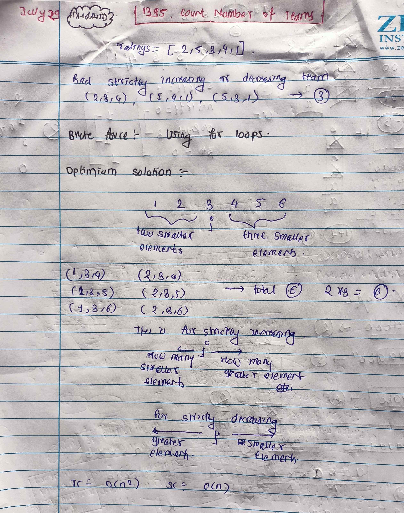

<!-- July 29 -->
# LeetCode - [1395. Count Number of Teams](https://leetcode.com/problems/count-number-of-teams/description/)

**Difficulty:** Medium

**Category:** Array, Math

---

## Dry Run

<p align="middle">
   
</p>

---

## Solution

```java
// Brute Force Approach

// class Solution {

//     private boolean isValidTeam(int[] rating, int i, int j, int k) {
//         return (rating[i] < rating[j] && rating[i] < rating[k] && rating[j] < rating[k]) ||
//                 (rating[i] > rating[j] && rating[i] > rating[k] && rating[j] > rating[k]);
//     }

//     public int numTeams(int[] rating) {
//         int n = rating.length;
//         int count = 0;
//         for (int i = 0; i < n - 2; i++) {
//             for (int j = i + 1; j < n - 1; j++) {
//                 for (int k = j + 1; k < n; k++) {
//                     if (isValidTeam(rating, i, j, k)) {
//                         count++;
//                     }
//                 }
//             }
//         }
//         return count;
//     }
// }

// Optimal Approach
class Solution {
    public int numTeams(int[] rating) {
        int n = rating.length;
        int count = 0;
        for (int j = 1; j < n - 1; j++) {
            int smallerToLeft = 0;
            int higherToLeft = 0;
            int smallerToRight = 0;
            int higherToRight = 0;

            for (int i = 0; i < j; i++) {
                smallerToLeft += rating[j] > rating[i] ? 1 : 0;
                higherToLeft += rating[j] < rating[i] ? 1 : 0;
            }

            for (int k = j + 1; k < n; k++) {
                smallerToRight += rating[j] > rating[k] ? 1 : 0;
                higherToRight += rating[j] < rating[k] ? 1 : 0;
            }

            count += (smallerToLeft * higherToRight) + (higherToLeft * smallerToRight);

        }

        return count;
    }
}
```
