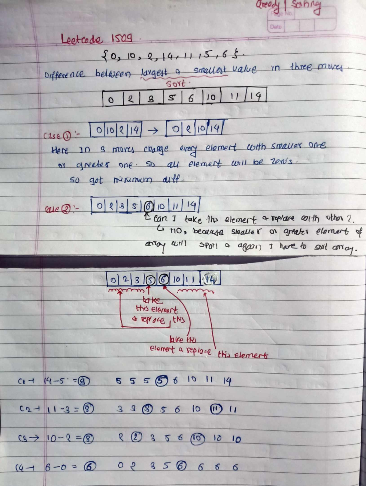

# LeetCode - [1509. Minimum Difference Between Largest and Smallest Value in Three Moves](https://leetcode.com/problems/minimum-difference-between-largest-and-smallest-value-in-three-moves/description/)

**Difficulty:** Medium

**Category:** Array, Greedy, Math

---

## Dry Run

<p align="middle">
   
 </p>

---

## Solution

```java
class Solution {
    public int minDifference(int[] nums) {
        int n = nums.length;
        Arrays.sort(nums);
        // case 1 :
        if (n <= 4) {
            return 0;
        }

        // case 2 :
        int ans = Integer.MAX_VALUE;
        ans = Math.min(ans, nums[n - 1] - nums[3]);
        ans = Math.min(ans, nums[n - 2] - nums[2]);
        ans = Math.min(ans, nums[n - 3] - nums[1]);
        ans = Math.min(ans, nums[n - 4] - nums[0]);

        return ans;
    }
}
```