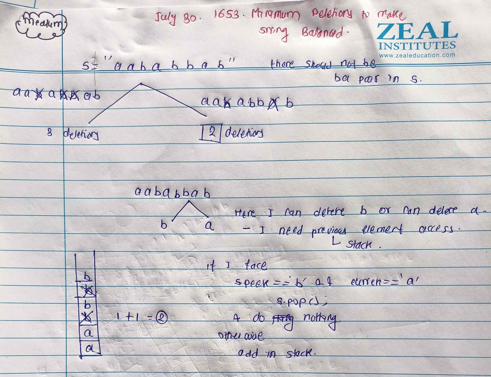

<!-- July 30 -->
# LeetCode - [1653. Minimum Deletions to Make String Balanced](https://leetcode.com/problems/second-minimum-time-to-reach-destination/)

**Difficulty:** Medium

**Category:** String, Stack, Array

---

## Dry Run

<p align="middle">
   
</p>

---

## Solution

```java
class Solution {
    public int minimumDeletions(String str) {
        Stack<Character> s = new Stack<>();
        int count = 0;
        for (char ch : str.toCharArray()) {
            if (!s.isEmpty() && s.peek() == 'b') {
                if (ch == 'a') {
                    s.pop();
                    count++;
                }
                else{
                    s.push(ch);
                }
            }
            else{
                s.push(ch);
            }
        }

        return count;
    }
}
```
