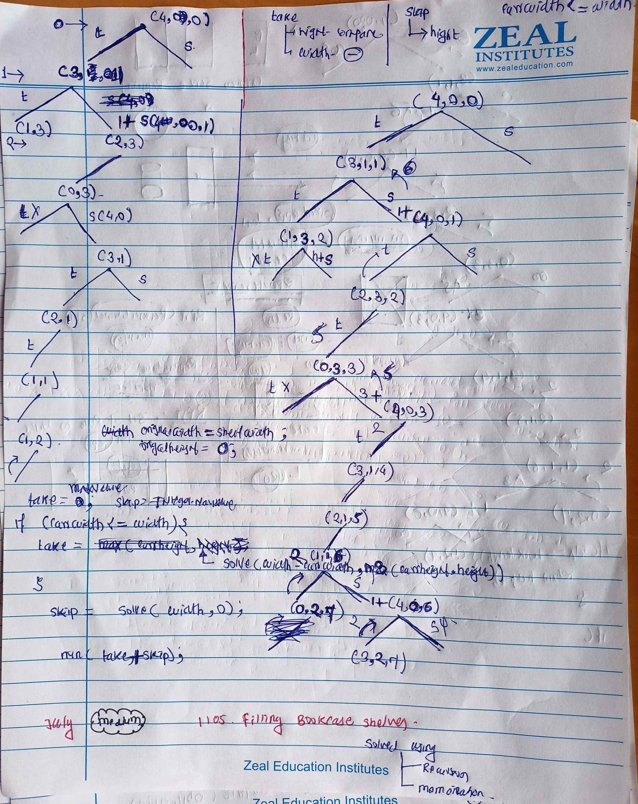
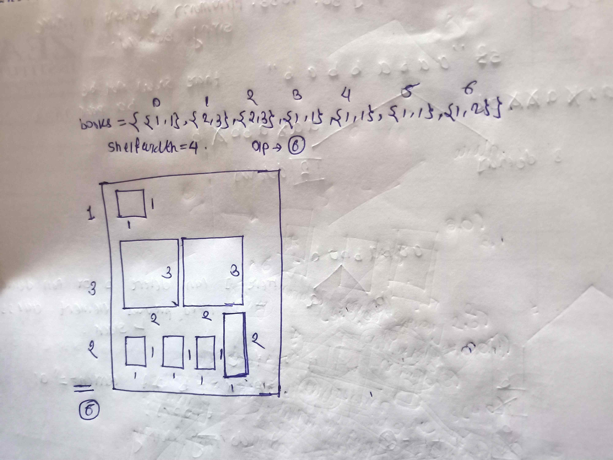

<!-- July 31 -->

# LeetCode - [1105. Filling Bookcase Shelves](https://leetcode.com/problems/filling-bookcase-shelves/description/?envType=daily-question&envId=2024-07-31)

**Difficulty:** Medium

**Category:** Arrays, DP

---

## Dry Run

<p align="middle">
   
 
</p>

---

## Solution

```java
// Approach 1 : Using Recursion(TLE)
// class Solution {
//     private int originalWidth;
//     private int originalHeight;

//     private int solve(int[][] books, int width, int height, int idx) {
//         int n = books.length;

//         if (idx == n) {
//             return height;
//         }

//         int take = Integer.MAX_VALUE;
//         int next = Integer.MAX_VALUE;

//         int currWidth = books[idx][0];
//         int currHeigth = books[idx][1];

//         if (currWidth <= width) {
//             take = solve(books, width - currWidth, Math.max(currHeigth, height), idx + 1);
//         }

//         if (height != 0) {
//             next = height + solve(books, originalWidth, originalHeight, idx);
//         }

//         return Math.min(take, next);
//     }

//     public int minHeightShelves(int[][] books, int shelfWidth) {
//         originalWidth = shelfWidth;
//         originalHeight = 0;
//         return solve(books, originalWidth, originalHeight, 0);
//     }
// }

// Approach 1 : Using Memo
class Solution {
    private int originalWidth;
    private int originalHeight;

    private int solve(int[][] books, Map<String, Integer> memo, int width, int height, int idx) {
        int n = books.length;

        if (idx == n) {
            return height;
        }

        String key = width + " " + height + " " + idx;

        if (memo.containsKey(key)) {
            return memo.get(key);
        }

        int take = Integer.MAX_VALUE;
        int next = Integer.MAX_VALUE;

        int currWidth = books[idx][0];
        int currHeigth = books[idx][1];

        if (currWidth <= width) {
            take = solve(books, memo, width - currWidth, Math.max(currHeigth, height), idx + 1);
        }

        if (height != 0) {
            next = height + solve(books, memo, originalWidth, originalHeight, idx);
        }

        memo.put(key, Math.min(take, next));

        return memo.get(key);
    }

    public int minHeightShelves(int[][] books, int shelfWidth) {
        int n = books.length;
        originalWidth = shelfWidth;
        originalHeight = 0;

        Map<String, Integer> memo = new HashMap<>();

        return solve(books, memo, originalWidth, originalHeight, 0);
    }
}
```
