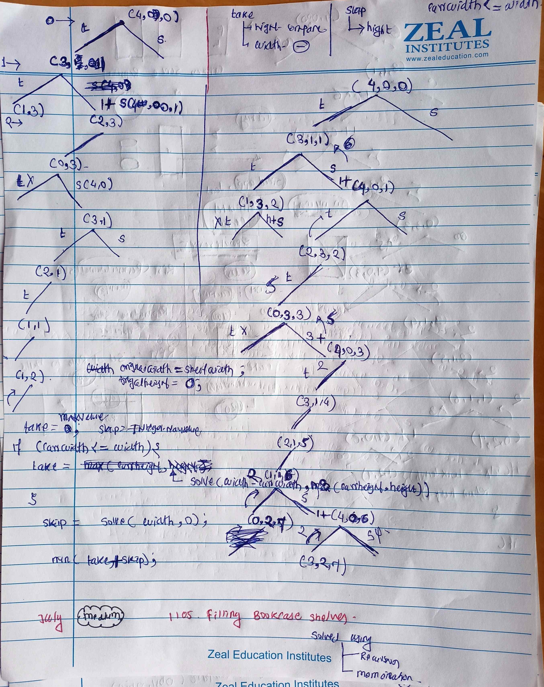
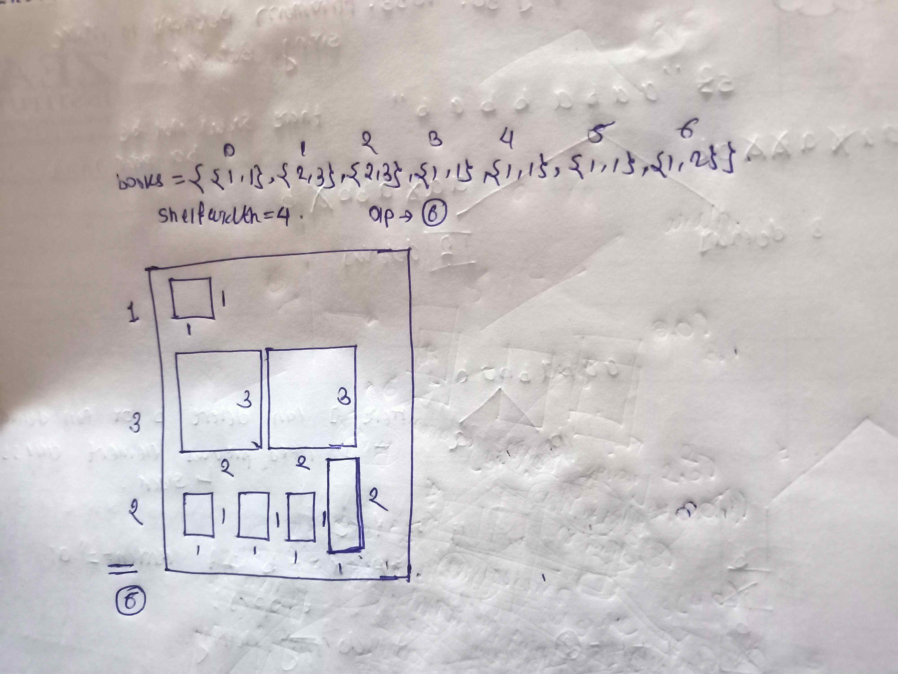

<!-- Setp 8 -->

# LeetCode - [725. Split Linked List in Parts](https://leetcode.com/problems/split-linked-list-in-parts/description/)

**Difficulty:** Medium

**Category:** Linked List, Arrays

---

## Dry Run

<p align="middle">
   
 
</p>

---

## Solution

```java
class Solution {
    public ListNode[] splitListToParts(ListNode head, int k) {
        List<Integer> nums = new ArrayList<>();
        ListNode ref = head;

        // Collect all values from the linked list
        while (ref != null) {
            nums.add(ref.val);
            ref = ref.next;
        }

        // Initialize the result array of ListNode
        ListNode[] ans = new ListNode[k];

        // Calculate base size for each part
        int partSize = nums.size() / k;
        // Calculate how many parts should have one extra node
        int extraNodes = nums.size() % k;

        int idx = 0;
        for (int i = 0; i < k; i++) {
            // Temporary dummy node to build the part
            ListNode temp = new ListNode();
            ListNode currNode = temp;

            // Current part size will either be partSize or partSize + 1 if extra nodes are available
            int currPartSize = partSize + (extraNodes > 0 ? 1 : 0);

            for (int j = 0; j < currPartSize && idx < nums.size(); j++) {
                // Create a new node for the current value and link it
                ListNode newNode = new ListNode(nums.get(idx++));
                currNode.next = newNode;
                currNode = newNode;
            }

            // Reduce extraNodes count after distributing one extra node to the current part
            if (extraNodes > 0) extraNodes--;

            // Assign the current part to the result array (excluding the dummy node)
            ans[i] = temp.next;
        }

        return ans;
    }
}
```
