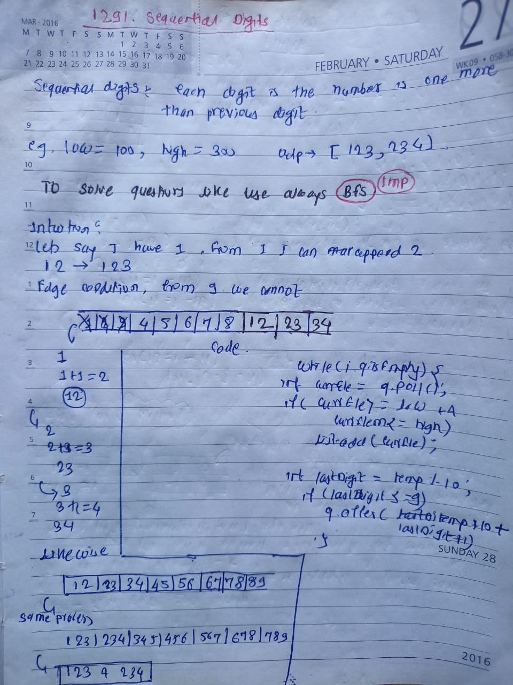

## 🔗 [1291. Sequential Digits](https://leetcode.com/problems/sequential-digits/) 

## Explanation(Dry Run)

<p align="middle">
   
</p>

## Code
```java
class Solution {
    public List<Integer> sequentialDigits(int low, int high) {
        List<Integer> list = new ArrayList<>();
        Queue<Integer> q = new LinkedList<>();
        for(int i=1;i<=8;i++){
            q.offer(i);
        }
        while(!q.isEmpty()){
            int currElement = q.poll();
            if(currElement>=low && currElement<=high){
                list.add(currElement);
            }
            int lastDigit = currElement%10;
            if(lastDigit+1<=9){
                int newElement = (currElement*10)+(lastDigit+1) ;
                if(newElement>high){
                    continue ;
                }
                q.offer(newElement);
            }
        }
        return list ;
    }
}
```


                                                     
