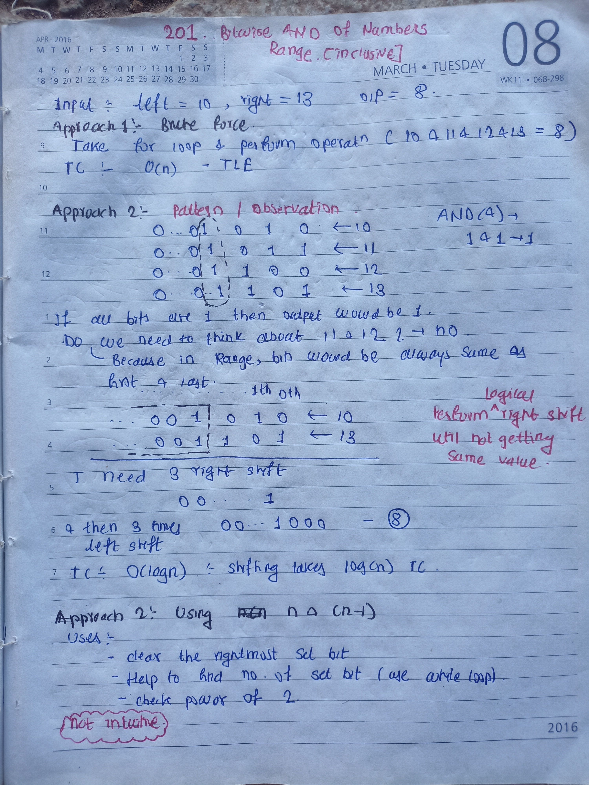

## 🔗 [201. Bitwise AND of Numbers Range](https://leetcode.com/problems/bitwise-and-of-numbers-range/description/)

## Explanation(Dry Run)

<p align="middle">
   
</p>


## Code

```java
class Solution {
    public int rangeBitwiseAnd(int left, int right) {
        int bitCount = 0;
        while (left != right) {
            left = left >> 1;
            right = right >> 1;
            bitCount++;
        }
        return left << bitCount;
    }
}
```

