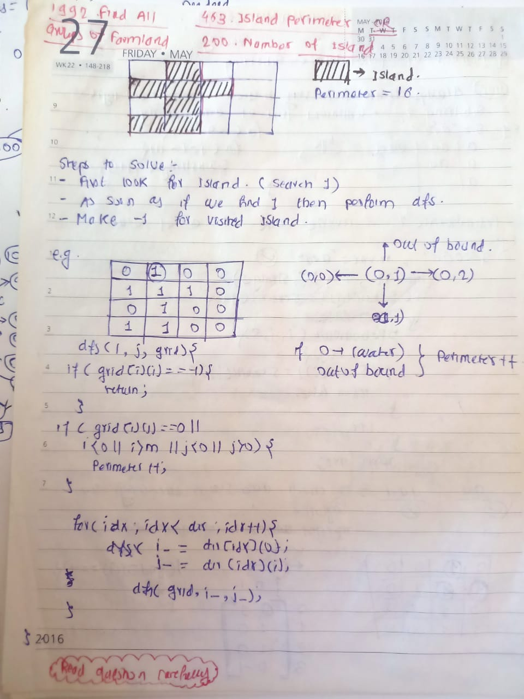

## 🔗 [1992. Find All Groups of Farmland](https://leetcode.com/problems/find-all-groups-of-farmland/description/)

## Explanation(Dry Run)

<p align="middle">
   
</p>

## Code
```java
class Solution {
    int c = -1;
    int d = -1;
    int dir[][] = { { 1, 0 }, { 0, 1 } };

    private void bfs(int[][] land, int i, int j) {
        int n = land.length;
        int m = land[0].length;

        Queue<int[]> queue = new LinkedList<>();
        queue.offer(new int[] { i, j });

        land[i][j] = 0;

        while (!queue.isEmpty()) {
            int top[] = queue.poll();
            c = Math.max(c, top[0]);
            d = Math.max(d, top[1]);
            for (int row[] : dir) {
                int i_ = top[0] + row[0];
                int j_ = top[1] + row[1];
                if (i_ < 0 || i_ >= n || j_ < 0 || j_ >= m || land[i_][j_] == 0) {
                    continue;
                }
                land[i_][j_] = 0;
                queue.offer(new int[] { i_, j_ });
            }
        }
    }

    public int[][] findFarmland(int[][] land) {
        List<int[]> temp = new ArrayList<>();
        for (int i = 0; i < land.length; i++) {
            for (int j = 0; j < land[i].length; j++) {
                if (land[i][j] == 1) {
                    bfs(land, i, j);
                    int currResult[] = { i, j, c, d };
                    temp.add(currResult);
                    c = -1;
                    d = -1;
                }
            }
        }
        int[][] ans = new int[temp.size()][4];
        int idx = 0;
        for (int row[] : temp) {
            ans[idx++] = row;
        }
        return ans;
    }
}
```


                                                     
