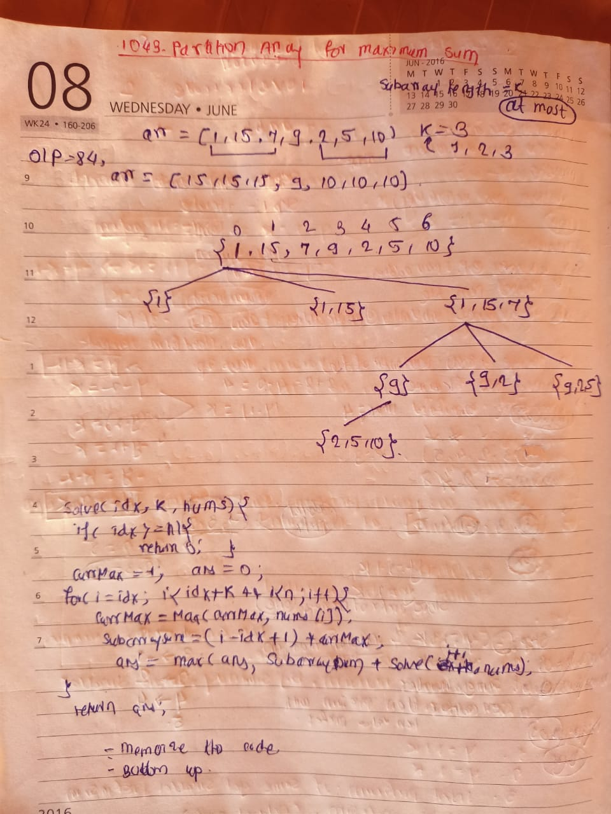

## 🔗 [1043. Partition Array for Maximum Sum](https://leetcode.com/problems/partition-array-for-maximum-sum/) 

## 👩‍💻 Explanation(Dry Run)

<p align="middle">
   
</p>

## Code
```java
class Solution {
        public int maxSumAfterPartitioning(int[] arr, int k) {
        int n = arr.length;
        int dp[] = new int[n+1] ;
        for(int j= n-1 ;j>=0 ;j--){
            int ans =0 ;
            int maxNum = -1 ;
            for (int i = j; i < j + k && i < n; i++) {
               maxNum = Math.max(maxNum, arr[i]);
               int subArrSum  = (i-j+1)*maxNum ;
               ans = Math.max(ans, subArrSum + dp[i+1]);
            } 
            dp[j] = ans ;
        }
        
        return dp[0];
    }
}
```


                                                     
