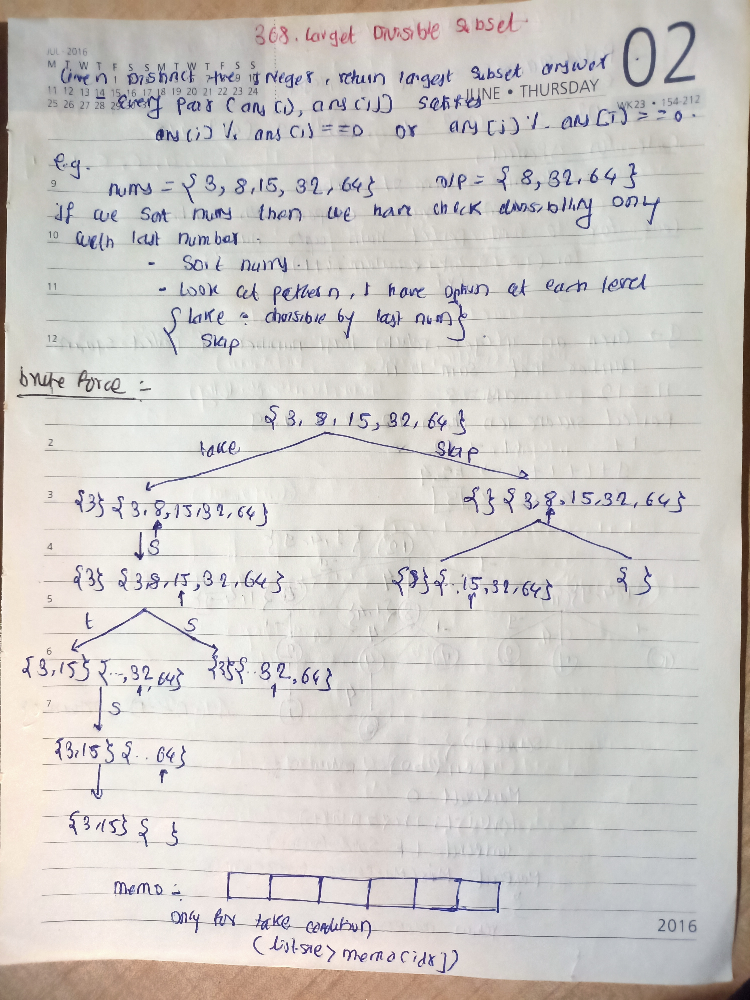
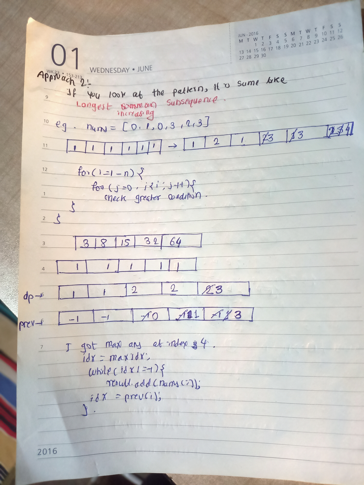

## 🔗 [368. Largest Divisible Subset](https://leetcode.com/problems/largest-divisible-subset/) 

## Explanation(Dry Run)

<p align="middle">
   
</p>
<p align="middle">
   
</p>

## Code
```java
class Solution {
    public List<Integer> largestDivisibleSubset(int[] nums) {
        Arrays.sort(nums);
        int n = nums.length;
        int dp[] = new int[n];
        int prev[] = new int[n];
        Arrays.fill(dp, 1);
        Arrays.fill(prev, -1);
        int maxIdx = 0;

        for (int i = 1; i < n; i++) {
            for (int j = 0; j < i; j++) {
                if (nums[i] % nums[j] == 0 && dp[i] < dp[j] + 1) {
                    dp[i] = dp[j] + 1;
                    prev[i] = j;
                    if (dp[i] > dp[maxIdx]) {
                        maxIdx = i;
                    }
                }
            }
        }

        List<Integer> result = new ArrayList<>();
        int idx = maxIdx;
        while (idx != -1) {
            result.add(nums[idx]);
            idx = prev[idx];
        }
        return result;
    }
}

```


                                                     
