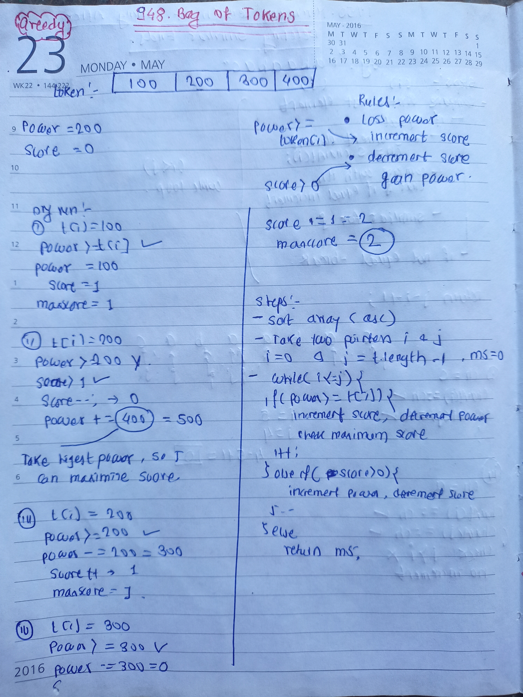

## 🔗 [948. Bag of Tokens](https://leetcode.com/problems/bag-of-tokens/) 


<p align="middle">
   
</p>


## Code
```java
class Solution {
    public int bagOfTokensScore(int[] tokens, int power) {
        Arrays.sort(tokens);
        int i=0 ;
        int j=tokens.length-1;
        int maxScore=0;
        int score=0;
        while(i<=j){
            if(power>=tokens[i]){
                power-=tokens[i];
                score++;
                if(score>maxScore){
                    maxScore=score;
                }
                i++;
            }else if(score>0){
                power+=tokens[j];
                score--;
                j--;
            }else{
                return maxScore ;
            }
        }
        return maxScore ;
    }
}
```


                                                     
