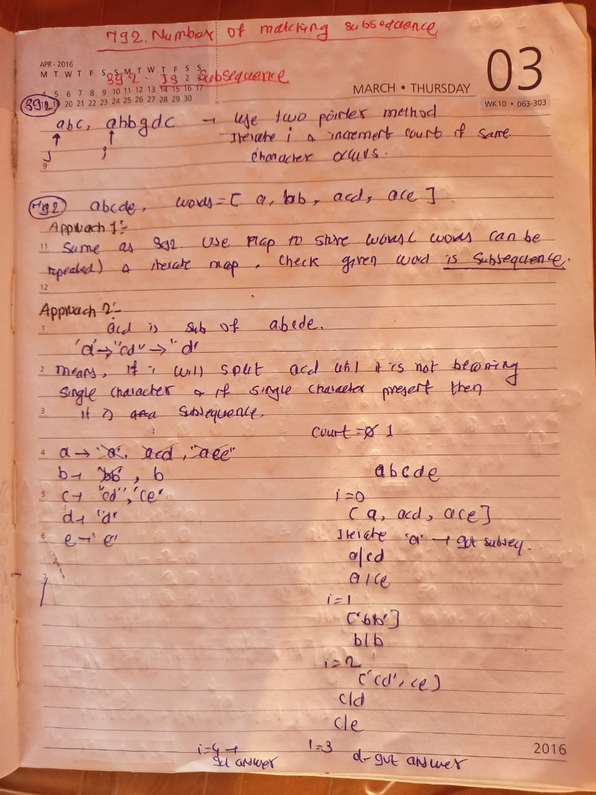

## 🔗 [792. Number of Matching Subsequences](https://leetcode.com/problems/number-of-matching-subsequences/)

## Explanation(Dry Run)

<p align="middle">
   
</p>

## Code

```java
class Solution {
   public int numMatchingSubseq(String s, String[] words) {
        Map<Character, Deque<String>> map = new HashMap<>();
        for (char ch = 'a'; ch <= 'z'; ch++) {
            map.put(ch, new LinkedList<>());
        }
        for (String word : words) {
            map.get(word.charAt(0)).addLast(word);
        }
        int count = 0;
        for (char ch : s.toCharArray()) {
            Deque<String> queue = map.get(ch);
            int size = queue.size();
            for (int i = 0; i < size; i++) {
                String str = queue.removeFirst();
                if (str.length() == 1) {
                    count++;
                } else {
                    map.get(str.charAt(1)).addLast(str.substring(1));
                }
            }
        }
        return count;
    }
}
```
