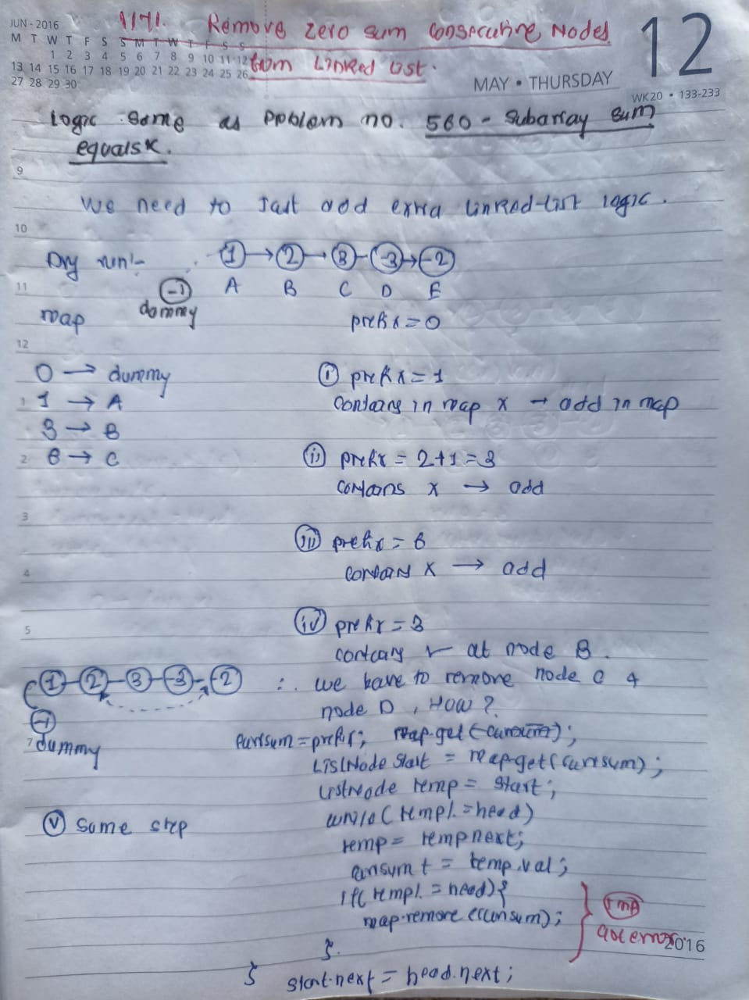

## 🔗 [1171. Remove Zero Sum Consecutive Nodes from Linked List](https://leetcode.com/problems/remove-zero-sum-consecutive-nodes-from-linked-list/description/) 

## Explanation(Dry Run)

<p align="middle">
   
</p>

## Formula
 visitedSum + k = totalSum
 </hr> 
 visitedSum = totalSum-k

## Code
```java
class Solution {
    public ListNode removeZeroSumSublists(ListNode head) {
        Map<Integer, ListNode> map = new HashMap<>();

        ListNode dummy = new ListNode(-1);
        dummy.next = head;
        map.put(0, dummy);
        int prefixSum = 0;
        while (head != null) {
            prefixSum += head.val;
            if (map.containsKey(prefixSum)) {
                int currSum = prefixSum;
                ListNode start = map.get(currSum);
                ListNode temp = start;
                while (temp != head) {
                    temp = temp.next;
                    currSum += temp.val;
                    if (temp != head) {
                        map.remove(currSum);
                    }
                }
                start.next = head.next;
            } else {
                map.put(prefixSum, head);
            }

            head = head.next;
        }

        return dummy.next;
    }
}
```


                                                     
