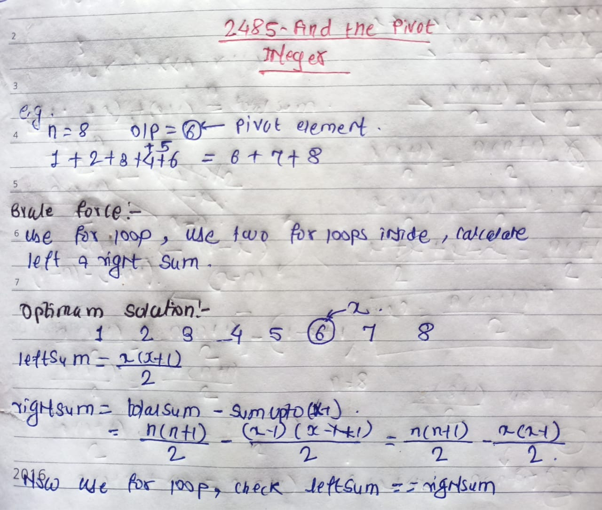

## 🔗 [2485. Find the Pivot Integer](https://leetcode.com/problems/find-the-pivot-integer/description/) 

## Explanation(Dry Run)

<p align="middle">
   
</p>

## Code
```java
  class Solution {
    int leftSum=0;
    int rightSum=0;
    public int pivotInteger(int n) {
         for(int x=0 ;x<=n;x++){
            leftSum = x *(x+1)/2 ;
            rightSum = n*(n+1)/2 - x*(x-1)/2 ;
            if(leftSum==rightSum){
                return x ;
            }
         }

         return -1 ;
    }
}
```


                                                     
