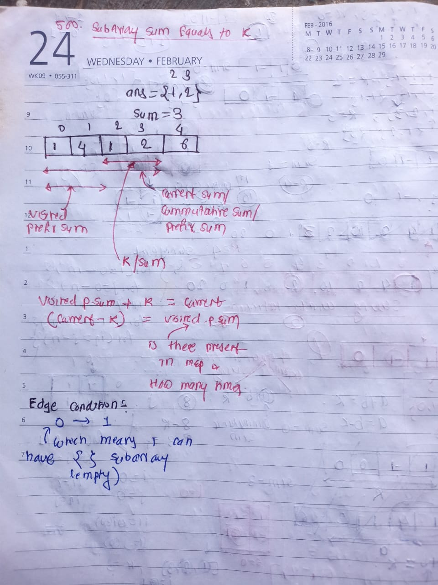

## 🔗 [560. Subarray Sum Equals K](https://leetcode.com/problems/subarray-sum-equals-k/description/)

## Explanation(Dry Run)

<p align="middle">
   
</p>

## Formula

visitedSum + k = totalSum

 </hr> 
 visitedSum = totalSum-k

## Code

```java
class Solution {
    public int subarraySum(int[] nums, int k) {
     Map<Integer,Integer> map = new HashMap<>();
     int prefixSum=0 ;
     int ans =0 ;
     map.put(0,1);
     for(int i=0;i<nums.length;i++){
         prefixSum += nums[i];
         int visitedSum = prefixSum-k ;
         if(map.containsKey(visitedSum)){
              ans += map.get(visitedSum);
         }
         map.put(prefixSum,map.getOrDefault(prefixSum,0)+1);
     }

     return ans ;

    }
}
```

# Similar Problems

## 🔗 [525. Contiguous Array](https://leetcode.com/problems/contiguous-array/)

### Intuition

nums = [0,1,0]

- If we replace 0 by -1 the we need to find only subarray sum equal to 0 .
- To calcuate maximum length store index corresponding to prefix sum.

## Code

```java
 class Solution {
    public int findMaxLength(int[] nums) {
    Map<Integer, Integer> map = new HashMap<>(Map.of(0,-1));
    int prefixSum = 0 ;
    int maxLen = 0 ;
    for (int i = 0; i < nums.length; i++) {
      prefixSum += nums[i]==0 ? -1 : 1 ;

      if(map.containsKey(prefixSum)){
          int idx = map.get(prefixSum);
          maxLen = Math.max(maxLen, i -idx);
      }else{
           map.put(prefixSum, i) ;
      }
    }

    return maxLen ;
}
}
```

## 930 , 1074
