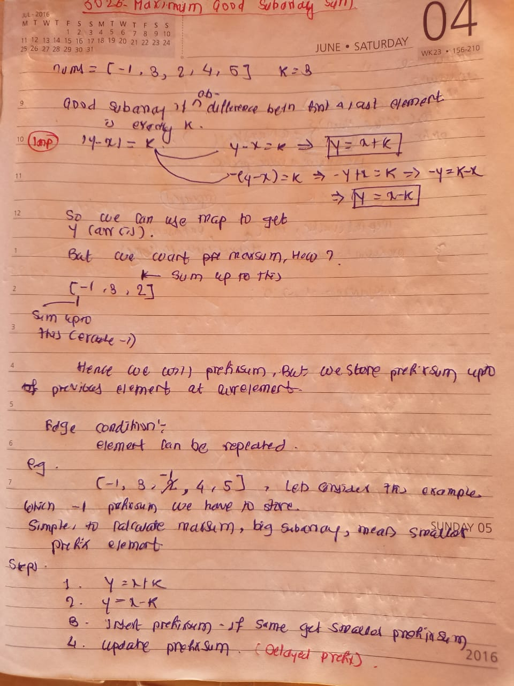

## 🔗 [3026. Maximum Good Subarray Sum](https://leetcode.com/problems/maximum-good-subarray-sum/) 

## Explanation(Dry Run)

<p align="middle">
   
</p>

## Code
```java
class Solution {
    public long maximumSubarraySum(int[] nums, int k) {
        long prefixSum = 0;
        long maxSum = Long.MIN_VALUE;
        // value prefixSum
        Map<Integer, Long> map = new HashMap<>();
        for (int value : nums) {
            if (map.containsKey(value - k)) {
                long validSum = map.get(value - k);
                maxSum = Math.max(maxSum,  prefixSum + value-validSum);
            }
            if (map.containsKey(value + k)) {
                long validSum = map.get(value + k);
                maxSum = Math.max(maxSum,  prefixSum + value-validSum);
            }
            map.put(value, Math.min(prefixSum, map.getOrDefault(value, Long.MAX_VALUE)));
            prefixSum += value;
        }

        return maxSum == Long.MIN_VALUE ? 0 : maxSum ;
    }
}
```


                                                     
