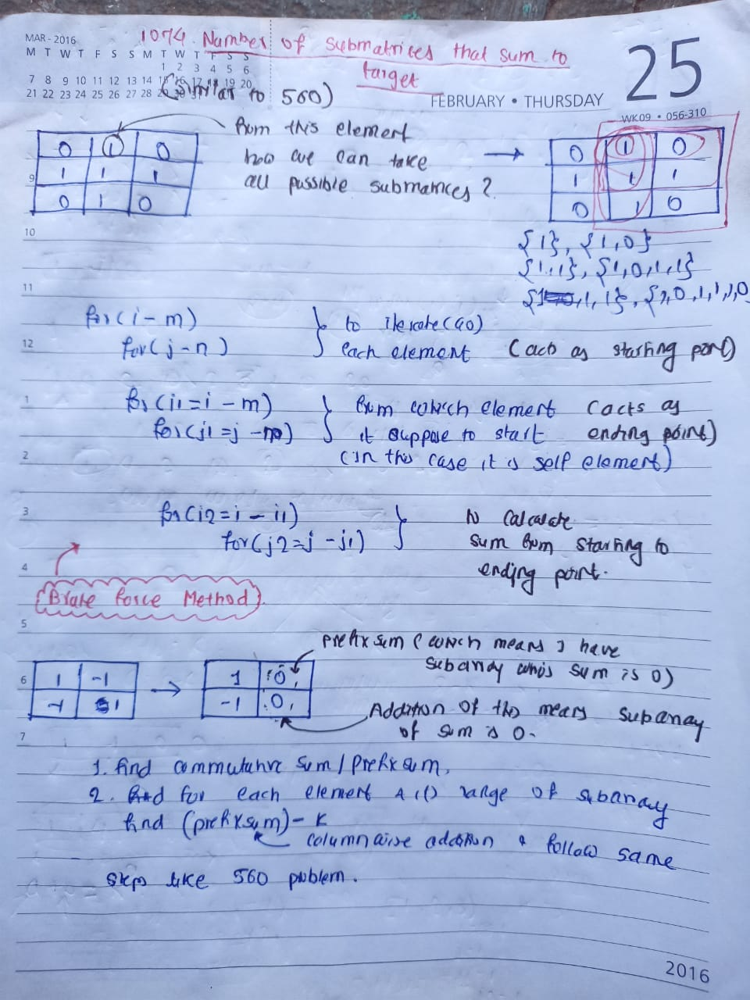

## 🔗 [1074. Number of Submatrices That Sum to Target](https://leetcode.com/problems/number-of-submatrices-that-sum-to-target/description/)

## Explanation(Dry Run)

<p align="middle">
   
</p>

## Code

```java
class Solution {
    public int numSubmatrixSumTarget(int[][] matrix, int target) {
       int ans =0 ;
       int m = matrix.length;
       int n = matrix[0].length;

       for(int row=0 ;row<m ;row++){
           int prefixSum = 0 ;
           for(int col=0;col<n;col++){
               prefixSum += matrix[row][col];
               matrix[row][col] =prefixSum ;
           }
       }
       
       for (int startCol = 0; startCol < n; startCol++) {
         for (int currCol = startCol; currCol < n; currCol++) {
             
            Map<Integer,Integer> map  = new HashMap<>(Map.of(0, 1)) ;
            int prefixSum = 0 ;
            for (int row = 0; row < m; row++) {
                prefixSum += matrix[row][currCol] - (startCol>0 ? matrix[row][startCol-1]: 0);
                int prevSum = prefixSum-target ;
                if(map.containsKey(prevSum)){
                    ans += map.get(prevSum);
                }
                map.put(prefixSum, map.getOrDefault(prefixSum, 0)+1);
            }
         }
       }
       return ans ;
    }
}
```


## 930 , 1074
