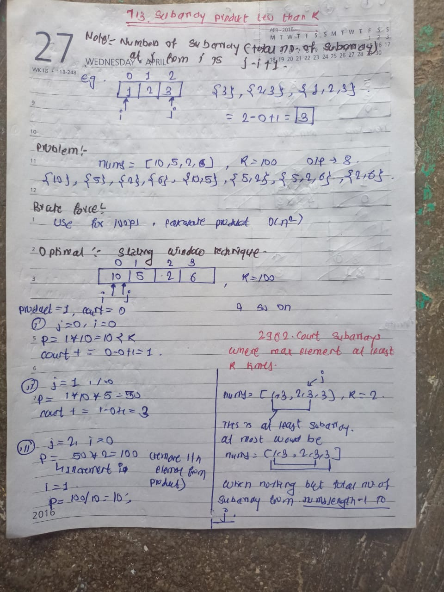

## 🔗 [713. Subarray Product Less Than K](https://leetcode.com/problems/subarray-product-less-than-k/description/) 

## Explanation(Dry Run)

<p align="middle">
   
</p>

## Code
```java
class Solution {
    public int numSubarrayProductLessThanK(int[] nums, int k) {
       int product = 1;
       int count=0;
       int i=0;
       if(k==0){
        return 0 ;
       }
       for(int j=0;j<nums.length;j++){
         product *= nums[j];
         while(i<=j && product>=k){
            product /=nums[i];
            i++;
         }
         if(i<=j){
            count += j-i+1 ;
         }
       } 
       return count ;
    }
}
```


                                                     
