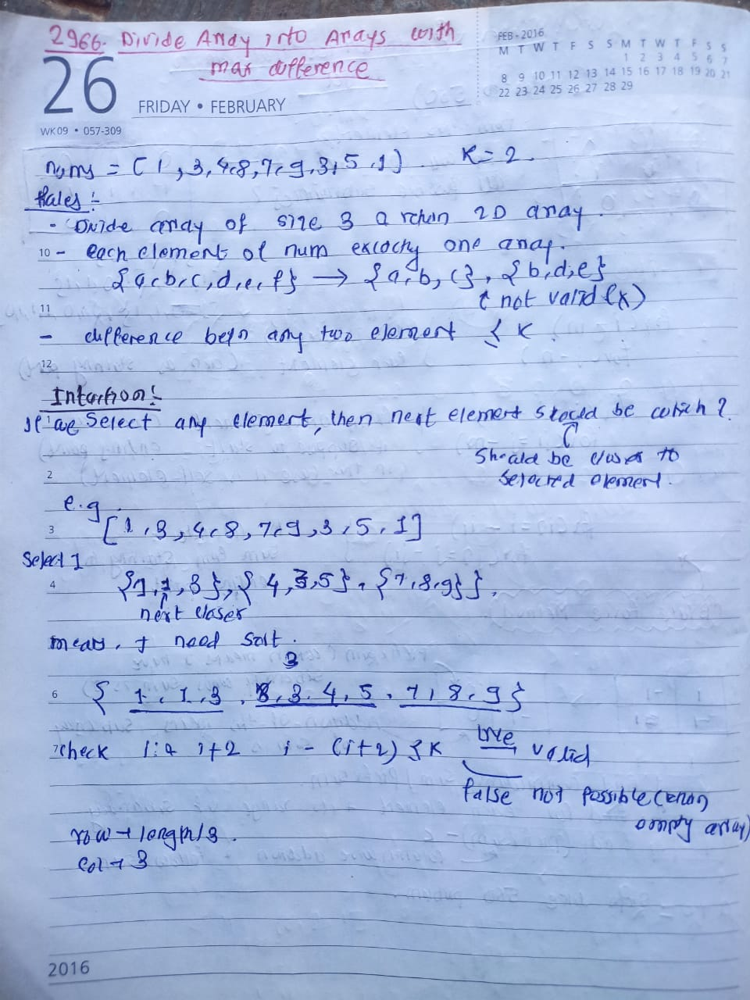

## 🔗 [2966. Divide Array Into Arrays With Max Difference](https://leetcode.com/problems/divide-array-into-arrays-with-max-difference/) 

## Explanation(Dry Run)

<p align="middle">
   
</p>

## Code
```java
class Solution {
    public int[][] divideArray(int[] nums, int k) {
        int m = nums.length / 3;
        int n = 3;
        int result[][] = new int[m][n];
        Arrays.sort(nums);
        int row = 0;
        for (int i = 0; i < nums.length; i = i + 3) {

            if (nums[i + 2] - nums[i] <= k) {
                for (int col = 0; col < n; col++) {
                    result[row][col] = nums[i + col];
                }
            } else {
                return new int[][] {};
            }
            row++;
        }
        return result;
    }
}
```


                                                     
