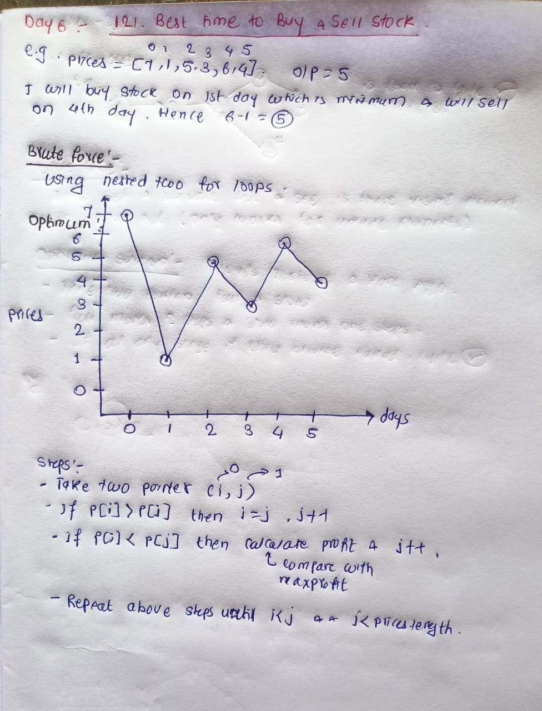

## 🔗 [121. Best Time to Buy and Sell Stock](https://leetcode.com/problems/best-time-to-buy-and-sell-stock/description/) 

## Explanation(Dry Run)

<p align="middle">
   
</p>

## Code
```java
class Solution {
    public int maxProfit(int[] prices) {
        int maxProfit = 0;
        int buyStockDay = 0;
        int sellStockDay = 1;
        while (buyStockDay < sellStockDay && sellStockDay < prices.length) {
            if (prices[buyStockDay] > prices[sellStockDay]) {
                buyStockDay = sellStockDay;
                }
            
            if (prices[buyStockDay] < prices[sellStockDay]) {
                maxProfit = Math.max(prices[sellStockDay] - prices[buyStockDay], maxProfit);
            }
            sellStockDay++;
        }
        return maxProfit;
    }
}
```


                                                     
